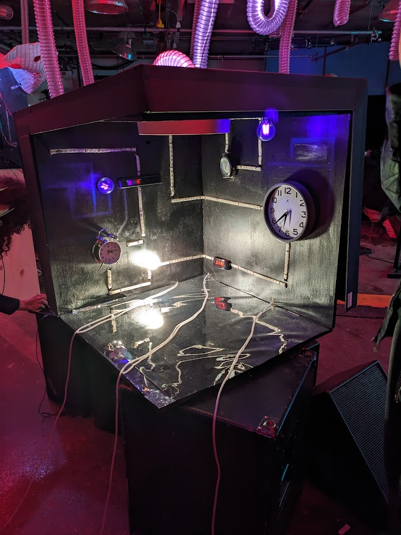
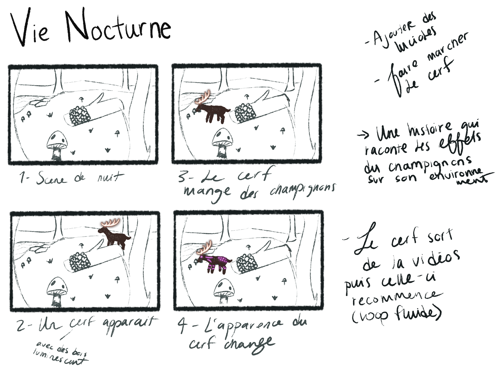
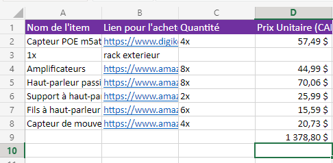
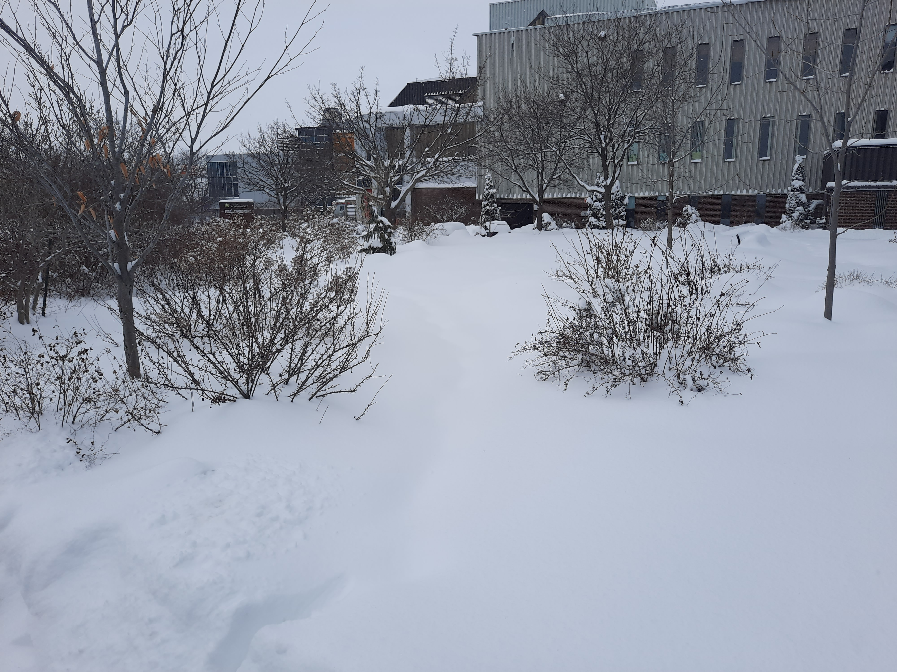

# Journal de création

## Semaine 9
> Contenu personnalisé à remplir par les équipes à chaque semaine faisant part du processus de création: résumé des réalisations d'équipe effectuées et des défis rencontrés sous forme d'un texte; ajout de vidéos, images, documents audios ou de contenu multimédia.)

Cette semaine a été parsemée de défis.

Tout d’abord, comme prévu, nous avons terminé de créer nos images dans Photoshop et le contenu 3D dans Maya. Nous avons également avancé la programmation multimédia du projet dans le logiciel Max et Unity.

Par la suite, nous avions prévu une séance d’enregistrement audio dans les studios de son. Cependant, misère (!), une panne d’électricité a eu lieu durant notre séance! Nous avons donc dû remettre celle-ci à quelques jours plus tard. (Nous avons beaucoup ri de cette situation.)

Enfin, nous venons de commencer à mettre en espace le projet dans le grand studio du collège. Nos projecteurs viennent tout juste d’être installés! 

On a bien hâte de voir le projet se concrétiser davantage dans les lieux physiques. À suivre

## Semaine 8

## Semaine 7

## Semaine 6

## Semaine 5

## Semaine 4

Ça aura été notre semaine avec le plus de progression visuel!

Tout d'abord, il a fallu réaliser des animations pour nos lumières que nous allions utiliser dans Madmapper.

Ensuite, il nous fallait également créer une façon de jouer le son dans les haut-parleur. Nous avons ainsi créé un déclencheur de son dans Max msp.

Après, il nous fallait également déclencher à la fois le son et la lumière à l'aide de Open Stage Control.

Finalement, toutes les compositions visuels pour les codes Qr ont été réalisés. Le site pour les animations est en processus de développement.

Nous sommes satisfait du travail effectué cette semaine et sommes confiant pour la suite des choses!

## Semaine 3

Cette semaine aura été efficace!

Tout d'abord, nous sommes allé visiter les étudiants en médias intéractifs de l'uqam pour voir les projets qu'ils sont en train de monter ainsi que pour leur présenter nos projets. Cela nous a permit de mieux comprendre le potentiel du matériel que nous allons utiliser.
 Projet en progression des étudiants de l'uqam.

Ensuite, il nous fallait commencer à travailler avec Madmapper pour se familiariser avec l'environnement ainsi que pour commencer à créer une scène.

Après, il fallait également commencer à créer le son que nous allons utiliser dans notre projet.

Aussi, il fallait créer des scénarios pour les animations en lien avec les codes Qr.

Finalement, il fallait commencer à concevoir une façon de faire pour recevoir les données du capteur de mouvement et que ça influence les lumières et le son.

Nous sommes content de la progression du projet!

## Semaine 2

Cette semaine aura été difficile!

Tout d'abord, il nous fallait impérativement arranger le document de préroduction pour ensuite tourner le 4 minutes de vidéo explicative de celle-ci.

Par la suite, il nous a fallu travailler d'avantage sur le document de préproduction car il manquait des éléments d'importances comme les codes QR.

Finalement, il nous fallait repenser notre liste de matériel pour nous permettre d'établir un début de budget.

Bref, une semaine chargé pour notre équipe!

## Semaine 1

Nous avons rencontré certains défis cette semaine.

Tout d’abord, comme prévu, nous avons déterminé les tâches de chacun dans ce projet. Nous avons également travaillé en équipe pour la réalisation de ces tâches qui consistait à mettre à jour la documentation de la préproduction.

Par la suite, nous voulions prendre des photos des lieux pour nous permettre de visualiser concrêtement où ce situerait notre insatallation. Cependant, la totalité des lieux était enneigés et donc innacessible.

Finalement, suite à le réunion du comité technique de jeudi matin, nous nous sommes rencontré en équipe pour discuter de la marche à suivre en terme de matériel à utiliser.

Nous sommes confiant pour la suite des choses et avons hâte de présenter ce que nous avons!

