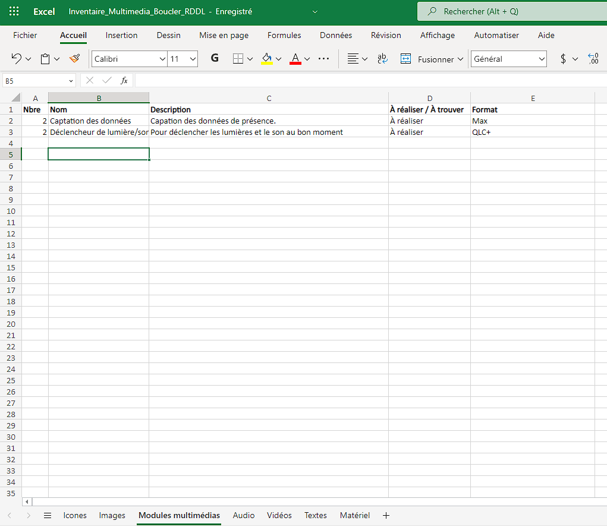
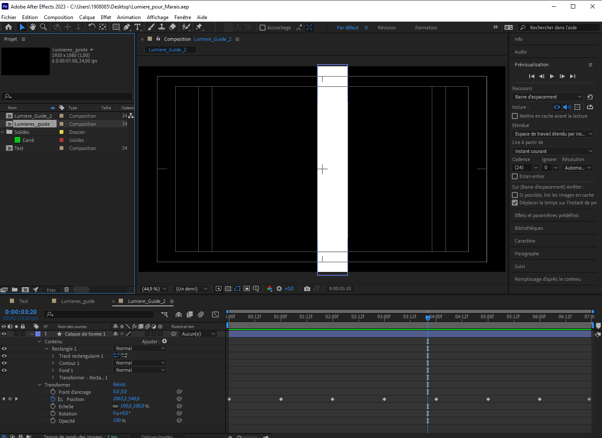
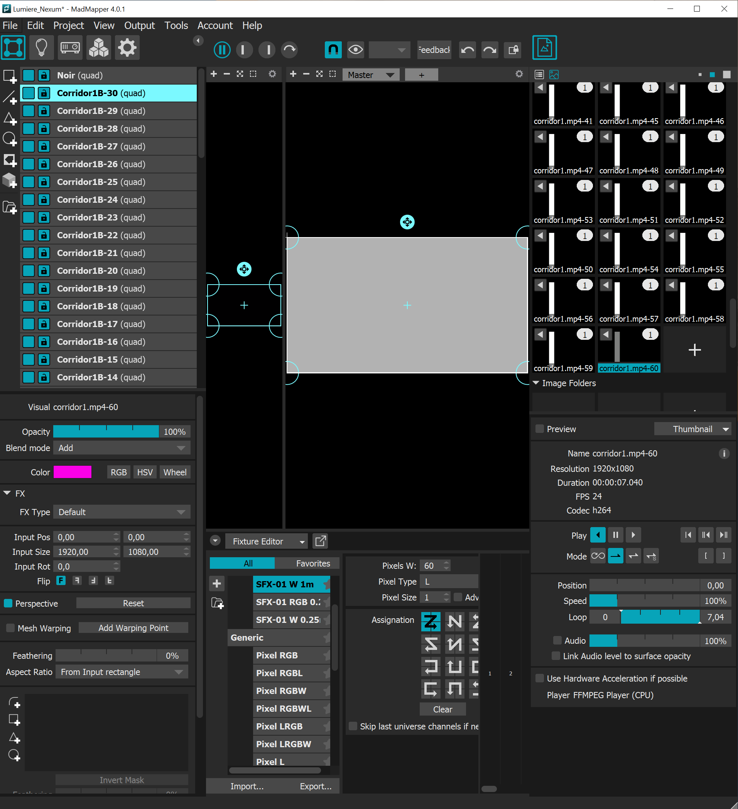

# Journal d'Alexandre

* [Semaine 1](#semaine-1)
* [Semaine 2](#semaine-2)
* [Semaine 3](#semaine-3)
* [Semaine 4](#semaine-4)
* [Semaine 5](#semaine-5)
* [Semaine de rattrapage](#semaine-de-rattrapage)
* [Semaine 6](#semaine-6)
* [Semaine 7](#semaine-7)
* [Semaine 8](#semaine-8)
* [Semaine 9](#semaine-9)

## Semaine 1

### Résumé des réalisations effectuées
- Mes collègues et moi avons retravaillé la cartographie et les plans de l'installation. 
- J'ai retravaillé l'intention de départ et le synopsis avec l'aide de Sabrina. J'ai aussi rédigé l'univers artistique. 

### Image d'une réalisation dont tu es la ou le plus fier

### Est-ce que j'ai accompli l'ensemble des tâches et objectifs que je m'étais fixés pour cette semaine?	
- [ ] Complètement
- [x] Assez
- [ ] Peu
- [ ] Pas du tout

#### Décrivez pourquoi.
Parce que nous avions prévu de travailler sur le budget, mais nous ne l'avons pas fait. Nous n'avons pas les prix des matériels prévus. 

#### S'il y a lieu, qu'allez-vous faire pour remédier à la situation?
Nous allons contacter, soit les superviseurs, les TTP ou bien la compagnie qui nous fournit le matériel.

### Mon projet s'est-il réalisé selon l’échéancier prévu?

- [ ] Complètement
- [x] Assez
- [ ] Un peu
- [ ] Pas tout à fait

#### S'il y a des écarts, décrivez-les.
Nous avons un léger contretemps; le terrain que nous voulons occuper n'est pas déneigé.

#### S'il y a lieu, qu'allez-vous faire pour remédier à la situation?
Des pelles.

### Défis pour la prochaine semaine
Nous devons finaliser le budget et la vidéo de présentation.

---
## Semaine 2
### Résumé des réalisations effectuées
-Mon équipe et moi avons retravaillé les thèmes, la répartition des zones et le matériel. 
-J'ai compléter l'inventaire multimédia. 

### Image d'une réalisation dont tu es la ou le plus fier 

### Est-ce que j'ai accompli l'ensemble des tâches et objectifs que je m'étais fixés pour cette semaine?

- [ ] Complètement
- [X] Assez
- [ ] Peu
- [ ] Pas du tout

#### Décrivez pourquoi. 
Disons que nous avons eu beaucoup de changements au niveau du scénario de la direction artistique.

#### S'il y a lieu, qu'allez-vous faire pour remédier à la situation?
Nous allons organiser une rencontre prochainement pour que nous soyons bien ancrés.

### Mon projet s'est-il réalisé selon l’échéancier prévu?

- [ ] Complètement
- [X] Assez
- [ ] Un peu
- [ ] Pas tout à fait

#### S'il y a des écarts, décrivez-les.
Il y a eu des retards dans l'agenda, à cause des nombreux changements au concept de l'installation.

#### S'il y a lieu, qu'allez-vous faire pour remédier à la situation?
Nous allons organiser une rencontre prochainement pour que nous soyons bien ancrés.

### Défis pour la prochaine semaine
Nous devons avoir quelque chose de concret à présenter pour être prêt pour le prototypage.

---
## Semaine 3 
### Résumé des réalisations effectuées
-Mon équipe et moi avons retravaillé les thèmes, la répartition des zones et le matériel. 
-Nous avons établi les rôles précis pour la "production multimédia". Je m'occupe de l'aspect visuel. Ce qui implique le fait que je dois réapprendre After Effects.

### Image d'une réalisation dont tu es la ou le plus fier

### Est-ce que j'ai accompli l'ensemble des tâches et objectifs que je m'étais fixés pour cette semaine?

- [ ] Complètement
- [X] Assez
- [ ] Peu
- [ ] Pas du tout

#### Décrivez pourquoi.
Nous avons bien travaillé, mais il y a des connaissances qui ne sont pas à notre portée pour le prototypage. Par exemple, l'utilisation de MadMapper. 

#### S'il y a lieu, qu'allez-vous faire pour remédier à la situation?
Nous allons regarder des guides sur Internet pour savoir comment connecter une lumière adressable sur ce logiciel. 

### Mon projet s'est-il réalisé selon l’échéancier prévu?

- [ ] Complètement
- [X] Assez
- [ ] Un peu
- [ ] Pas tout à fait

#### S'il y a des écarts, décrivez-les.
Nous avons eu certains problèmes concernant la vidéo de présentation du projet et la liste de matériel. 

#### S'il y a lieu, qu'allez-vous faire pour remédier à la situation?
Nous allons prendre un peu de recul pour savoir ce dont nous avons vraiment besoin. 

### Défis pour la prochaine semaine
Commencer le prototypage avec le matériel. 

---
## Semaine 4
### Résumé des réalisations effectuées 
- Nous avons officiellement commencé le protoypage. 
- J'ai commencé à maîtriser After Effects et MadMapper pour faire l'aspect visuel du prototype. 

### Image d'une réalisation dont tu es la ou le plus fier
 

### Est-ce que j'ai accompli l'ensemble des tâches et objectifs que je m'étais fixés pour cette semaine?

- [ ] Complètement
- [x] Assez
- [ ] Peu
- [ ] Pas du tout

#### Décrivez pourquoi.
Il y a le synopsis qui n'est plus à jour. De plus, il y a une partie "Lumières" dans la préproduction qui est incomplète. 

#### S'il y a lieu, qu'allez-vous faire pour remédier à la situation?
Je vais essayer de règler cette situation durant la fin de semaine.

### Mon projet s'est-il réalisé selon l’échéancier prévu?

- [ ] Complètement
- [x] Assez
- [ ] Un peu
- [ ] Pas tout à fait

#### S'il y a des écarts, décrivez-les.
Malgré que le prototypage soit complet, nous aurions pu utiliser plus de temps pour paufiner les éclairages. 

#### S'il y a lieu, qu'allez-vous faire pour remédier à la situation?
Évaluer ce que nous allons avoir de besoin en terme de médias à importer dans MadMapper. 

### Défis pour la prochaine semaine
Faire les nombreuses étapes de l'éclairage sur MadMapper et synchroniser l'audio avec Max.

---
## Semaine 5
### Résumé des réalisations effectuées
- Nous avons continué et finaliser le prototype. Nous sommes presque prêt à l'installation. 
- Nous avons travailler sur Max et sur MadMapper afin d'avoir le résultat attendu. 
- J'ai conçu de nouvelles animations à être importées dans MadMapper.

### Image d'une réalisation dont tu es la ou le plus fier
 

### Est-ce que j'ai accompli l'ensemble des tâches et objectifs que je m'étais fixés pour cette semaine?

- [x] Complètement
- [ ] Assez
- [ ] Peu
- [ ] Pas du tout

#### Décrivez pourquoi.
Nous vaons pour but d'importer des animations sur MadMapper et de travailler sur Max pour perfectionner le prototype.

#### S'il y a lieu, qu'allez-vous faire pour remédier à la situation?

### Mon projet s'est-il réalisé selon l’échéancier prévu?

- [ ] Complètement
- [x] Assez
- [ ] Un peu
- [ ] Pas tout à fait

#### S'il y a des écarts, décrivez-les.
Il y a toujours place à l'amélioration; l'animation dans MadMapper n'est clairement pas l'animation définitive.

#### S'il y a lieu, qu'allez-vous faire pour remédier à la situation?
Il faudrait travailler un peu plus en dehors des cours pour prendre plus d'avance. C'était quelque chose que nous avons fait durant la préproduction, mais moins dans le prototype.

### Défis pour la prochaine semaine
Finir les préparatifs à l'installation extérieure et faire les animations définitive sur After Effects. 

---
## Semaine de rattrapage
### Résumé des réalisations effectuées

### Image d'une réalisation dont tu es la ou le plus fier

### Est-ce que j'ai accompli l'ensemble des tâches et objectifs que je m'étais fixés pour cette semaine?

- [ ] Complètement
- [ ] Assez
- [ ] Peu
- [ ] Pas du tout

#### Décrivez pourquoi.
 

#### S'il y a lieu, qu'allez-vous faire pour remédier à la situation?

### Mon projet s'est-il réalisé selon l’échéancier prévu?

- [ ] Complètement
- [ ] Assez
- [ ] Un peu
- [ ] Pas tout à fait

#### S'il y a des écarts, décrivez-les.

#### S'il y a lieu, qu'allez-vous faire pour remédier à la situation?

### Défis pour la prochaine semaine

---
## Semaine 6
### Résumé des réalisations effectuées

### Image d'une réalisation dont tu es la ou le plus fier

### Est-ce que j'ai accompli l'ensemble des tâches et objectifs que je m'étais fixés pour cette semaine?

- [ ] Complètement
- [ ] Assez
- [ ] Peu
- [ ] Pas du tout

#### Décrivez pourquoi.
 

#### S'il y a lieu, qu'allez-vous faire pour remédier à la situation?

### Mon projet s'est-il réalisé selon l’échéancier prévu?

- [ ] Complètement
- [ ] Assez
- [ ] Un peu
- [ ] Pas tout à fait

#### S'il y a des écarts, décrivez-les.

#### S'il y a lieu, qu'allez-vous faire pour remédier à la situation?

### Défis pour la prochaine semaine

---
## Semaine 7
### Résumé des réalisations effectuées

### Image d'une réalisation dont tu es la ou le plus fier

### Est-ce que j'ai accompli l'ensemble des tâches et objectifs que je m'étais fixés pour cette semaine?

- [ ] Complètement
- [ ] Assez
- [ ] Peu
- [ ] Pas du tout

#### Décrivez pourquoi.
 

#### S'il y a lieu, qu'allez-vous faire pour remédier à la situation?

### Mon projet s'est-il réalisé selon l’échéancier prévu?

- [ ] Complètement
- [ ] Assez
- [ ] Un peu
- [ ] Pas tout à fait

#### S'il y a des écarts, décrivez-les.

#### S'il y a lieu, qu'allez-vous faire pour remédier à la situation?

### Défis pour la prochaine semaine

## Semaine 8

## Semaine 9
