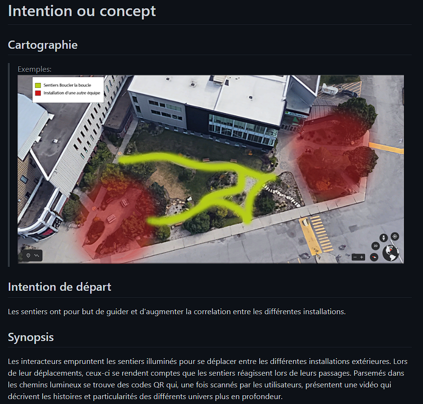
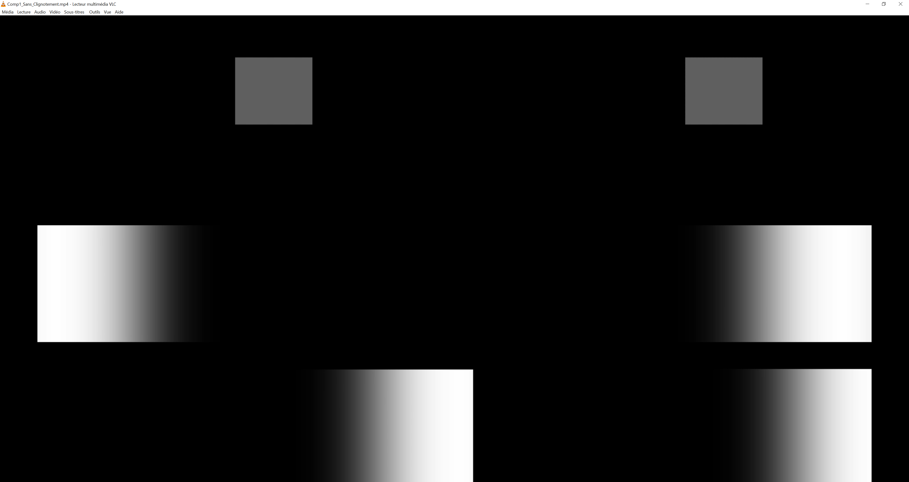

# Journal d'Alexandre

* [Semaine 1](#semaine-1)
* [Semaine 2](#semaine-2)
* [Semaine 3](#semaine-3)
* [Semaine 4](#semaine-4)
* [Semaine 5](#semaine-5)
* [Semaine de rattrapage](#semaine-de-rattrapage)
* [Semaine 6](#semaine-6)
* [Semaine 7](#semaine-7)
* [Semaine 8](#semaine-8)
* [Semaine 9](#semaine-9)

## Semaine 1

### Résumé des réalisations effectuées
- Mes collègues et moi avons retravaillé la cartographie et les plans de l'installation. 
- J'ai retravaillé l'intention de départ et le synopsis avec l'aide de Sabrina. J'ai aussi rédigé l'univers artistique. 

### Image d'une réalisation dont tu es la ou le plus fier

### Est-ce que j'ai accompli l'ensemble des tâches et objectifs que je m'étais fixés pour cette semaine?	
- [ ] Complètement
- [x] Assez
- [ ] Peu
- [ ] Pas du tout

#### Décrivez pourquoi.
Parce que nous avions prévu de travailler sur le budget, mais nous ne l'avons pas fait. Nous n'avons pas les prix des matériels prévus. 

#### S'il y a lieu, qu'allez-vous faire pour remédier à la situation?
Nous allons contacter, soit les superviseurs, les TTP ou bien la compagnie qui nous fournit le matériel.

### Mon projet s'est-il réalisé selon l’échéancier prévu?

- [ ] Complètement
- [x] Assez
- [ ] Un peu
- [ ] Pas tout à fait

#### S'il y a des écarts, décrivez-les.
Nous avons un léger contretemps; le terrain que nous voulons occuper n'est pas déneigé.

#### S'il y a lieu, qu'allez-vous faire pour remédier à la situation?
Des pelles.

### Défis pour la prochaine semaine
Nous devons finaliser le budget et la vidéo de présentation.

---
## Semaine 2
### Résumé des réalisations effectuées
-Mon équipe et moi avons retravaillé les thèmes, la répartition des zones et le matériel. 
-J'ai compléter l'inventaire multimédia. 

### Image d'une réalisation dont tu es la ou le plus fier 

### Est-ce que j'ai accompli l'ensemble des tâches et objectifs que je m'étais fixés pour cette semaine?

- [ ] Complètement
- [X] Assez
- [ ] Peu
- [ ] Pas du tout

#### Décrivez pourquoi. 
Disons que nous avons eu beaucoup de changements au niveau du scénario de la direction artistique.

#### S'il y a lieu, qu'allez-vous faire pour remédier à la situation?
Nous allons organiser une rencontre prochainement pour que nous soyons bien ancrés.

### Mon projet s'est-il réalisé selon l’échéancier prévu?

- [ ] Complètement
- [X] Assez
- [ ] Un peu
- [ ] Pas tout à fait

#### S'il y a des écarts, décrivez-les.
Il y a eu des retards dans l'agenda, à cause des nombreux changements au concept de l'installation.

#### S'il y a lieu, qu'allez-vous faire pour remédier à la situation?
Nous allons organiser une rencontre prochainement pour que nous soyons bien ancrés.

### Défis pour la prochaine semaine
Nous devons avoir quelque chose de concret à présenter pour être prêt pour le prototypage.

---
## Semaine 3 
### Résumé des réalisations effectuées
-Mon équipe et moi avons retravaillé les thèmes, la répartition des zones et le matériel. 
-Nous avons établi les rôles précis pour la "production multimédia". Je m'occupe de l'aspect visuel. Ce qui implique le fait que je dois réapprendre After Effects.

### Image d'une réalisation dont tu es la ou le plus fier

### Est-ce que j'ai accompli l'ensemble des tâches et objectifs que je m'étais fixés pour cette semaine?

- [ ] Complètement
- [X] Assez
- [ ] Peu
- [ ] Pas du tout

#### Décrivez pourquoi.
Nous avons bien travaillé, mais il y a des connaissances qui ne sont pas à notre portée pour le prototypage. Par exemple, l'utilisation de MadMapper. 

#### S'il y a lieu, qu'allez-vous faire pour remédier à la situation?
Nous allons regarder des guides sur Internet pour savoir comment connecter une lumière adressable sur ce logiciel. 

### Mon projet s'est-il réalisé selon l’échéancier prévu?

- [ ] Complètement
- [X] Assez
- [ ] Un peu
- [ ] Pas tout à fait

#### S'il y a des écarts, décrivez-les.
Nous avons eu certains problèmes concernant la vidéo de présentation du projet et la liste de matériel. 

#### S'il y a lieu, qu'allez-vous faire pour remédier à la situation?
Nous allons prendre un peu de recul pour savoir ce dont nous avons vraiment besoin. 

### Défis pour la prochaine semaine
Commencer le prototypage avec le matériel. 

---
## Semaine 4
### Résumé des réalisations effectuées 
- Nous avons officiellement commencé le protoypage. 
- J'ai commencé à maîtriser After Effects et MadMapper pour faire l'aspect visuel du prototype. 

### Image d'une réalisation dont tu es la ou le plus fier
 

### Est-ce que j'ai accompli l'ensemble des tâches et objectifs que je m'étais fixés pour cette semaine?

- [ ] Complètement
- [x] Assez
- [ ] Peu
- [ ] Pas du tout

#### Décrivez pourquoi.
Il y a le synopsis qui n'est plus à jour. De plus, il y a une partie "Lumières" dans la préproduction qui est incomplète. 

#### S'il y a lieu, qu'allez-vous faire pour remédier à la situation?
Je vais essayer de règler cette situation durant la fin de semaine.

### Mon projet s'est-il réalisé selon l’échéancier prévu?

- [ ] Complètement
- [x] Assez
- [ ] Un peu
- [ ] Pas tout à fait

#### S'il y a des écarts, décrivez-les.
Malgré que le prototypage soit complet, nous aurions pu utiliser plus de temps pour paufiner les éclairages. 

#### S'il y a lieu, qu'allez-vous faire pour remédier à la situation?
Évaluer ce que nous allons avoir de besoin en terme de médias à importer dans MadMapper. 

### Défis pour la prochaine semaine
Faire les nombreuses étapes de l'éclairage sur MadMapper et synchroniser l'audio avec Max.

---
## Semaine 5
### Résumé des réalisations effectuées
- Nous avons continué et finaliser le prototype. Nous sommes presque prêt à l'installation. 
- Nous avons travailler sur Max et sur MadMapper afin d'avoir le résultat attendu. 
- J'ai conçu de nouvelles animations à être importées dans MadMapper.

### Image d'une réalisation dont tu es la ou le plus fier
 

### Est-ce que j'ai accompli l'ensemble des tâches et objectifs que je m'étais fixés pour cette semaine?

- [x] Complètement
- [ ] Assez
- [ ] Peu
- [ ] Pas du tout

#### Décrivez pourquoi.
Nous vaons pour but d'importer des animations sur MadMapper et de travailler sur Max pour perfectionner le prototype.

#### S'il y a lieu, qu'allez-vous faire pour remédier à la situation?

### Mon projet s'est-il réalisé selon l’échéancier prévu?

- [ ] Complètement
- [x] Assez
- [ ] Un peu
- [ ] Pas tout à fait

#### S'il y a des écarts, décrivez-les.
Il y a toujours place à l'amélioration; l'animation dans MadMapper n'est clairement pas l'animation définitive.

#### S'il y a lieu, qu'allez-vous faire pour remédier à la situation?
Il faudrait travailler un peu plus en dehors des cours pour prendre plus d'avance. C'était quelque chose que nous avons fait durant la préproduction, mais moins dans le prototype.

### Défis pour la prochaine semaine
Finir les préparatifs à l'installation extérieure et faire les animations définitive sur After Effects. 

---
## Semaine de rattrapage
### Résumé des réalisations effectuées
- Nous avons appris comment passer par Sonobus pour déclencher les effets sonores. 
- J'ai conçu de nouvelles animations à être importées dans MadMapper. 

### Image d'une réalisation dont tu es la ou le plus fier
 

### Est-ce que j'ai accompli l'ensemble des tâches et objectifs que je m'étais fixés pour cette semaine?

- [ ] Complètement
- [ ] Assez
- [X] Peu
- [ ] Pas du tout

#### Décrivez pourquoi.
 Une situation qui était hors de notre contrôle nous empêcher de pleinement continuer nos expérimentations; il y eu une panne d'électricité dans le studio et il y avait peu d'alternative pour régler ce problème. 

#### S'il y a lieu, qu'allez-vous faire pour remédier à la situation?
Euh... Des électriciens? 

### Mon projet s'est-il réalisé selon l’échéancier prévu?

- [ ] Complètement
- [X] Assez
- [ ] Un peu
- [ ] Pas tout à fait

#### S'il y a des écarts, décrivez-les.
Comme décrit plus haut, la panne nous a mis des bâtons dans les roues. Nous avons prévu à la base de voir quel matériel allait dehors ou à l'intérieur, mais vant nous avons voulu faire un test final. Sans électricité, nous n'avons rien fait de cela. 

#### S'il y a lieu, qu'allez-vous faire pour remédier à la situation?
Il va falloir mettre les bouchées doubles la semaine prochaine. 

### Défis pour la prochaine semaine
Nous DEVONS absolument faire le test final et voir pour quel matériel nous aurons de besoin à l'extérieur comme à l'intérieur.

---
## Semaine 6
### Résumé des réalisations effectuées
- Pelletage. 
- J'ai encore retravaillé des animations pour MadMapper. 
- Nous avons configuré les chemins pour que leurs éclairages soient  indépendant.

### Image d'une réalisation dont tu es la ou le plus fier
 

### Est-ce que j'ai accompli l'ensemble des tâches et objectifs que je m'étais fixés pour cette semaine?

- [ ] Complètement
- [X] Assez
- [ ] Peu
- [ ] Pas du tout

#### Décrivez pourquoi.
Nous avons finalement pelleter la neige qui nous bloquait le chemin. Nous avons aussi, régler un problème concernant Sonobus. Cependant, nous n'avaons pas encore conçu les boîtiers étanches pour les capteurs.

#### S'il y a lieu, qu'allez-vous faire pour remédier à la situation?
Nous allons faire le plus vite possible pour faire nos boîtiers et percer des trous en dessous pour les fils... Ça ne sera plus vraiment étanche, mais bon.

### Mon projet s'est-il réalisé selon l’échéancier prévu?

- [ ] Complètement
- [X] Assez
- [ ] Un peu
- [ ] Pas tout à fait

#### S'il y a des écarts, décrivez-les.
Nous sommes quand même bien avancés, mais nous avons eu des retards soit à cause d'un manque de matériel ou d'un manque de temps pour perfectionner notre parcours. Par exemple, configurer des capteurs pour une animation qui partiait du milieu. 

#### S'il y a lieu, qu'allez-vous faire pour remédier à la situation?
Il faudra prendre de l'initiative pour savoir si nous avons besoin de cette animation. Si oui, je risque d'avir du boulot à faire sur MadMapper.

### Défis pour la prochaine semaine 
Ça sera nos préparations pour faire sortir notre parcous dehors avec la fibre optique.

---
## Semaine 7
### Résumé des réalisations effectuées
- Nous avons finalement sorti notre installation à l'entrée 1. 
- Nous avons travaillé sur les branchements et la communication par fibre optique. 

### Image d'une réalisation dont tu es la ou le plus fier

### Est-ce que j'ai accompli l'ensemble des tâches et objectifs que je m'étais fixés pour cette semaine?

- [ ] Complètement
- [x] Assez
- [ ] Peu
- [ ] Pas du tout

#### Décrivez pourquoi.
La majorité du travail est fait, il manque juste des composantes esthétiques. 

#### S'il y a lieu, qu'allez-vous faire pour remédier à la situation?
Nous pensions faire du "sapinage" sur les ponts d'éclairage pour décorer. 

### Mon projet s'est-il réalisé selon l’échéancier prévu?

- [ ] Complètement
- [x] Assez
- [ ] Un peu
- [ ] Pas tout à fait

#### S'il y a des écarts, décrivez-les.
Il y a eu de nombreux bogues au niveau des lumières; des mauvaises adresses, certaines ont fait des siennes à cause de MadMapper, etc. 

#### S'il y a lieu, qu'allez-vous faire pour remédier à la situation?
Nous allons consulter des spécialistes du logiciel et des lumières pour régler le problème. 

### Défis pour la prochaine semaine
S'occuper du côté esthétique du parcours et faire le "cable management" à l'extérieur. 

## Semaine 8
### Résumé des réalisations effectuées
- Mon équipe et moi avons finalement présenté nos projets au public.
- Nous avons finalisé la vidéo de présentation.

### Image d'une réalisation dont tu es la ou le plus fier 

### Est-ce que j'ai accompli l'ensemble des tâches et objectifs que je m'étais fixés pour cette semaine?

- [X] Complètement
- [ ] Assez
- [ ] Peu
- [ ] Pas du tout

#### Décrivez pourquoi. 
On est très fier de notre projet ainsi que de l'avis du public que nous avons reçu. 

#### S'il y a lieu, qu'allez-vous faire pour remédier à la situation?

### Mon projet s'est-il réalisé selon l’échéancier prévu?

- [ ] Complètement
- [X] Assez
- [ ] Un peu
- [ ] Pas tout à fait

#### S'il y a des écarts, décrivez-les.
Il n'y a eu que de légers retards concernant la réalisation de la vidéo de présentation.

#### S'il y a lieu, qu'allez-vous faire pour remédier à la situation?
On a dû augmenter la vitesse pour monter la vidéo.

### Défis pour la prochaine semaine
Euh... Réussir mon projet pour mon autre cours? 

## Semaine 9
