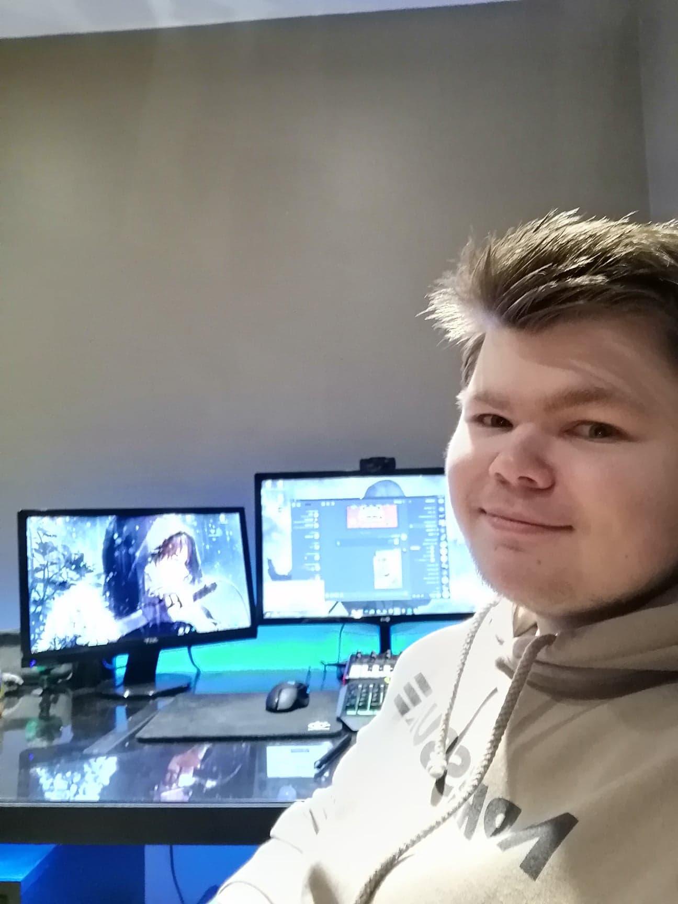
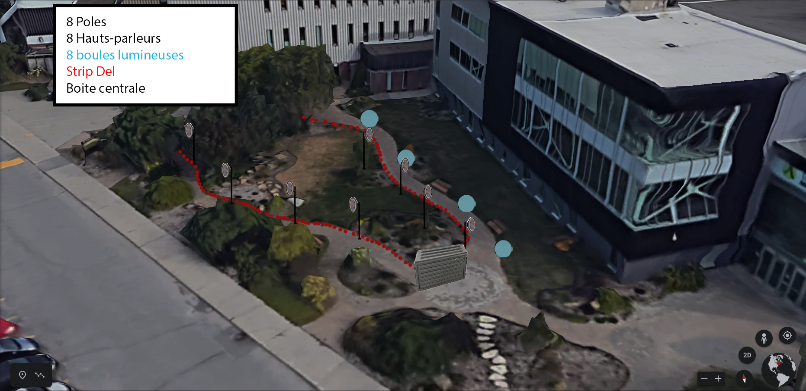
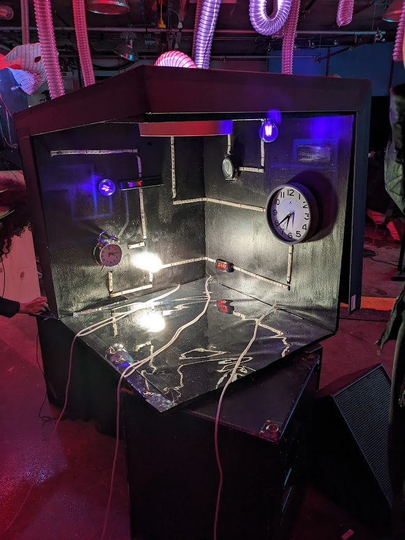

# Journal de Maxime Des Lauriers

* [Semaine 1](#semaine-1)
* [Semaine 2](#semaine-2)
* [Semaine 3](#semaine-3)
* [Semaine 4](#semaine-4)
* [Semaine 5](#semaine-5)
* [Semaine de rattrapage](#semaine-de-rattrapage)
* [Semaine 6](#semaine-6)
* [Semaine 7](#semaine-7)
* [Semaine 8](#semaine-8)
* [Semaine 9](#semaine-9)

## Semaine 1

### Résumé des réalisations effectuées
- Retour sur le projet, s'assurer d'avoir une vision commune.
- Ajuster la page d'accueil et les pages de membres. 
- Changer la liste de matériel.
- Repenser la localisation de chaque éléments.
- Plusieurs discussions/brainstorm d'équipe.

### Image d'une réalisation dont tu es la ou le plus fier

### Est-ce que j'ai accompli l'ensemble des tâches et objectifs que je m'étais fixés pour cette semaine?	
- [ ] Complètement
- [x] Assez
- [ ] Peu
- [ ] Pas du tout

#### Décrivez pourquoi.
Puisque c'était la première semaine, la majorité des tâches se sont crées au fur et à mesure donc il n'y avait pas de plan ou liste de tâche à compléter mardi matin.

#### S'il y a lieu, qu'allez-vous faire pour remédier à la situation?
Il n'y a pas de problèmes majeurs pour le moment. Il faut continuer de communiquer et s'assurer que la vision du projet est commune pour tout le monde.

### Mon projet s'est-il réalisé selon l’échéancier prévu?

- [ ] Complètement
- [x] Assez
- [ ] Un peu
- [ ] Pas tout à fait

#### S'il y a des écarts, décrivez-les.
Le seul bémol pour l'instant est le fait que l'on ne peut pas estimer un budget parce que les prix de ReCr4te ne sont pas affichés dans les catalogues. Aussi, il est difficile d'estimer la quantité de lumières que nous allons avoir besoin puisque les chemins que nous allons emprunter sont bloqués par la neige.

#### S'il y a lieu, qu'allez-vous faire pour remédier à la situation?
Nous pouvons utiliser des outils tels que google maps pour donner une quantité approximative de lumières nécessaires pour notre projet.

### Défis pour la prochaine semaine
Terminer la préproduction pour avoir une approbation durant la séance mardi prochain.

---
## Semaine 2
### Résumé des réalisations effectuées
Repenser le projet avec les nouveaux enjeux (espace emprunté, matériel utilisé) et baisser la charge de travail de notre projet pour qu'il soit réalisable.

### Image d'une réalisation dont tu es la ou le plus fier

### Est-ce que j'ai accompli l'ensemble des tâches et objectifs que je m'étais fixés pour cette semaine?

- [ ] Complètement
- [x] Assez
- [ ] Peu
- [ ] Pas du tout

#### Décrivez pourquoi.
 Le projet évolue et change à chaque jour et nous pousse à toujours régler les nouveaux problèmes auxquels nous faisons face. Néanmoins, le projet prend forme et on se rapproche d'un projet intéressant qui vaut la peine d'être créé et visité par le public.

#### S'il y a lieu, qu'allez-vous faire pour remédier à la situation?

### Mon projet s'est-il réalisé selon l’échéancier prévu?

- [ ] Complètement
- [ ] Assez
- [x] Un peu
- [ ] Pas tout à fait

#### S'il y a des écarts, décrivez-les.
Le projet évolue beaucoup dans nos têtes mais nous oublions souvent d'écrire les changements ou ajouter les choses qui doivent être ajoutés dans notre documentation.

#### S'il y a lieu, qu'allez-vous faire pour remédier à la situation?
S'assurer de garder trace de tout chanmgement qui est discuté.

### Défis pour la prochaine semaine
Commencer à prototyper des animations de lumière et commencer la conception des sons qui vont englober notre projet.

---
## Semaine 3 
### Résumé des réalisations effectuées
Finalisation de la plantation, conceptualisation de l'ambiance sonore et simulations d'interaction avec lumière.

### Image d'une réalisation dont tu es la ou le plus fier

### Est-ce que j'ai accompli l'ensemble des tâches et objectifs que je m'étais fixés pour cette semaine?

- [ ] Complètement
- [x] Assez
- [ ] Peu
- [ ] Pas du tout

#### Décrivez pourquoi.
 Le projet avance é prend fore de jour en jour. Cepandant, il manqueait quelques spécifications dans le document de préproduction.

#### S'il y a lieu, qu'allez-vous faire pour remédier à la situation?
Compléter le document

### Mon projet s'est-il réalisé selon l’échéancier prévu?

- [ ] Complètement
- [x] Assez
- [ ] Un peu
- [ ] Pas tout à fait

#### S'il y a des écarts, décrivez-les.

#### S'il y a lieu, qu'allez-vous faire pour remédier à la situation?

### Défis pour la prochaine semaine
Terminer les sketchs d'animations de sons/luimières. Prototyper une animation de lumière et de son au signal du capteur de mouvement.
---
## Semaine 4
### Résumé des réalisations effectuées

### Image d'une réalisation dont tu es la ou le plus fier

### Est-ce que j'ai accompli l'ensemble des tâches et objectifs que je m'étais fixés pour cette semaine?

- [ ] Complètement
- [ ] Assez
- [ ] Peu
- [ ] Pas du tout

#### Décrivez pourquoi.
 

#### S'il y a lieu, qu'allez-vous faire pour remédier à la situation?

### Mon projet s'est-il réalisé selon l’échéancier prévu?

- [ ] Complètement
- [ ] Assez
- [ ] Un peu
- [ ] Pas tout à fait

#### S'il y a des écarts, décrivez-les.

#### S'il y a lieu, qu'allez-vous faire pour remédier à la situation?

### Défis pour la prochaine semaine

---
## Semaine 5
### Résumé des réalisations effectuées

### Image d'une réalisation dont tu es la ou le plus fier

### Est-ce que j'ai accompli l'ensemble des tâches et objectifs que je m'étais fixés pour cette semaine?

- [ ] Complètement
- [ ] Assez
- [ ] Peu
- [ ] Pas du tout

#### Décrivez pourquoi.
 

#### S'il y a lieu, qu'allez-vous faire pour remédier à la situation?

### Mon projet s'est-il réalisé selon l’échéancier prévu?

- [ ] Complètement
- [ ] Assez
- [ ] Un peu
- [ ] Pas tout à fait

#### S'il y a des écarts, décrivez-les.

#### S'il y a lieu, qu'allez-vous faire pour remédier à la situation?

### Défis pour la prochaine semaine

---
## Semaine de rattrapage
### Résumé des réalisations effectuées

### Image d'une réalisation dont tu es la ou le plus fier

### Est-ce que j'ai accompli l'ensemble des tâches et objectifs que je m'étais fixés pour cette semaine?

- [ ] Complètement
- [ ] Assez
- [ ] Peu
- [ ] Pas du tout

#### Décrivez pourquoi.
 

#### S'il y a lieu, qu'allez-vous faire pour remédier à la situation?

### Mon projet s'est-il réalisé selon l’échéancier prévu?

- [ ] Complètement
- [ ] Assez
- [ ] Un peu
- [ ] Pas tout à fait

#### S'il y a des écarts, décrivez-les.

#### S'il y a lieu, qu'allez-vous faire pour remédier à la situation?

### Défis pour la prochaine semaine

---
## Semaine 6
### Résumé des réalisations effectuées

### Image d'une réalisation dont tu es la ou le plus fier

### Est-ce que j'ai accompli l'ensemble des tâches et objectifs que je m'étais fixés pour cette semaine?

- [ ] Complètement
- [ ] Assez
- [ ] Peu
- [ ] Pas du tout

#### Décrivez pourquoi.
 

#### S'il y a lieu, qu'allez-vous faire pour remédier à la situation?

### Mon projet s'est-il réalisé selon l’échéancier prévu?

- [ ] Complètement
- [ ] Assez
- [ ] Un peu
- [ ] Pas tout à fait

#### S'il y a des écarts, décrivez-les.

#### S'il y a lieu, qu'allez-vous faire pour remédier à la situation?

### Défis pour la prochaine semaine

---
## Semaine 7
### Résumé des réalisations effectuées

### Image d'une réalisation dont tu es la ou le plus fier

### Est-ce que j'ai accompli l'ensemble des tâches et objectifs que je m'étais fixés pour cette semaine?

- [ ] Complètement
- [ ] Assez
- [ ] Peu
- [ ] Pas du tout

#### Décrivez pourquoi.
 

#### S'il y a lieu, qu'allez-vous faire pour remédier à la situation?

### Mon projet s'est-il réalisé selon l’échéancier prévu?

- [ ] Complètement
- [ ] Assez
- [ ] Un peu
- [ ] Pas tout à fait

#### S'il y a des écarts, décrivez-les.

#### S'il y a lieu, qu'allez-vous faire pour remédier à la situation?

### Défis pour la prochaine semaine

## Semaine 8

## Semaine 9
