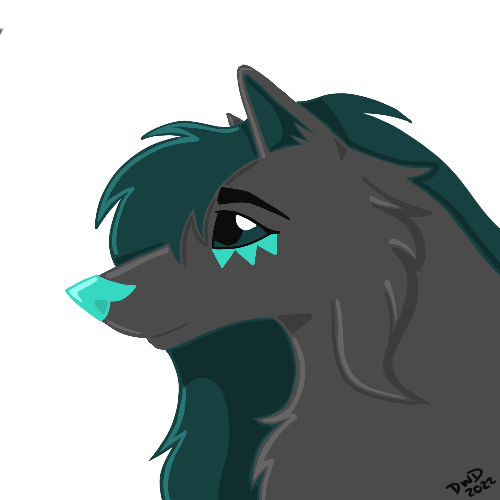
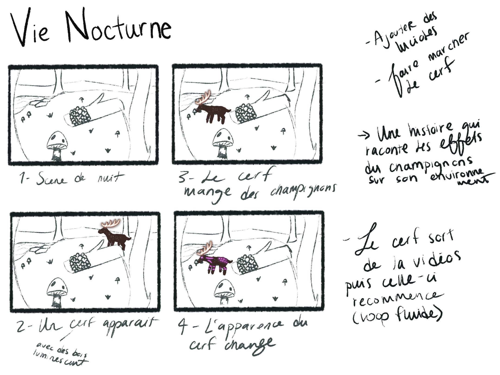

# Journal de Sabrina Laforest

* [Semaine 1](#semaine-1)
* [Semaine 2](#semaine-2)
* [Semaine 3](#semaine-3)
* [Semaine 4](#semaine-4)
* [Semaine 5](#semaine-5)
* [Semaine de rattrapage](#semaine-de-rattrapage)
* [Semaine 6](#semaine-6)
* [Semaine 7](#semaine-7)
* [Semaine 8](#semaine-8)
* [Semaine 9](#semaine-9)

## Semaine 1

### Résumé des réalisations effectuées
- Retour sur le projet avec l'équipe; s'assurer d'avoir une vision commune 
- Ré-écriture de l'intention et du synopsis avec Alexandre
- Commencer a imaginer les vidéos pour les codes QR

### Est-ce que j'ai accompli l'ensemble des tâches et objectifs que je m'étais fixés pour cette semaine?	
- [ ] Complètement
- [x] Assez
- [ ] Peu
- [ ] Pas du tout

#### Décrivez pourquoi.
Étant donné que mes vidéos porteront sur tout les projets j'attends que les concepts des autres équipes soient presque finaliser. Donc je n'ai pas pu beaucoup avancer vu que la majorité des équipes repensent leur concepts et idées.

#### S'il y a lieu, qu'allez-vous faire pour remédier à la situation?
Il faut que je parle plus au autres équipes et voir où elles en sont avec leur idées. Je doit redoubler de créativité et d'originalité pour mes concepts (beaucoup de réflexions et moddboards a venir).

### Mon projet s'est-il réalisé selon l’échéancier prévu?

- [ ] Complètement
- [ ] Assez
- [x] Un peu
- [ ] Pas tout à fait

#### S'il y a des écarts, décrivez-les.
J'aurais préféré pouvoir commencer mes illustrations pour les vidéos a la semaine 2 et que la majorité des concepts pour celles-ci soient coulées dans le béton.

#### S'il y a lieu, qu'allez-vous faire pour remédier à la situation?
Il faut vraiment que je me décide sur mes concepts pour commencer les ''sketchs'' au minimum

### Défis pour la prochaine semaine
- Mettre a jour mes idées pour les vidéos
- Faire les moodboards pour chacunes d'entre elles 
- Faire des sketchs des éléments/personnages importants des vidéos (si possible aussi des scenes importantes)
- Ajouter plus d'élément sur ma partie du projet dans le document de préproduction

---
## Semaine 2
### Résumé des réalisations effectuées
- Population de la section 'Code QR' dans la préproduction
- Choix des thèmes/histoires/idées des vidéos
- Création des moodboards pour chaque vidéos
- Début des mini scénarios pour chaque vidéo d'animation

### Image d'une réalisation dont tu es la ou le plus fier

### Est-ce que j'ai accompli l'ensemble des tâches et objectifs que je m'étais fixés pour cette semaine?

- [ ] Complètement
- [x] Assez
- [ ] Peu
- [ ] Pas du tout

#### Décrivez pourquoi.
 Bien que j'ai fini mes moodboards avec les nouvelles idées il aurait été idéal d'avoir fini mes scénarios pour que tout soit concret/dans le béton. Les vidéos sont encore un peu dans les nuages (voir idées abstraites) vu que les scénario ne sont pas fini ce qui rend l'explications de celles-ci plus compliquées.

#### S'il y a lieu, qu'allez-vous faire pour remédier à la situation?
Voir les défis/tâches pour la semaine prochaine

### Mon projet s'est-il réalisé selon l’échéancier prévu?

- [ ] Complètement
- [x] Assez
- [ ] Un peu
- [ ] Pas tout à fait

#### S'il y a des écarts, décrivez-les.
Bien que j'aurais aimer avoir déjà commencer mes animation repenser les concepts de celles-ci ont prit plus de temps que prévu. Les concepts de vidéos ont passé d'histoires des autres projets finaux à l'histoire de nos sentiers lumineux/l'environnement de ceux-ci ce qui a pousser notre équipe a réfléchir sur qu'elle était l'intention réelle du projet si il n'y avait aucun autre projet de déployer en même temps. Après de longue discussions nous avons décider d'aller vers un 'Marais Fongique'.

#### S'il y a lieu, qu'allez-vous faire pour remédier à la situation?
Je dois prendre des décisions plus rapidement et en ce fait même commencer mes sketchs et animations. Je dois arrêter de douter de mes choix, car je me stoppe moi même dans mon avancement du projet en ayant peur de faire les mauvais choix (et que mon équipe soit mécontente de mes choix).

### Défis pour la prochaine semaine
- Faire le design final pour les champignons
- Finir les mini scénarios pour chaque animations + les séparer en différentes scènes (pour éviter d'avoir un fichier très lourd à exporter)
- Début des animations!!!

---
## Semaine 3 
### Résumé des réalisations effectuées
- Finir la population de la section 'Code QR' dans la préproduction
- Creation du logo du projet
- Debut de la baniere du projet
- Debut de la fiche informative sur le champignon
- Finition des mini scénarios pour chaque vidéo d'animation
- Participation au tournage de la video explicative
- Creation des issues dans le tableau des taches pour les animations
- Debut des animations!!! 

### Image d'une réalisation dont tu es la ou le plus fier

Bien qu'il n'y ai pas beaucoup de scenes je trouve que le message et les notes sont claires. J'ai pu inclure des elements qui m'interessent et me stimule j'ai tres hate de commence cette video! 

### Est-ce que j'ai accompli l'ensemble des tâches et objectifs que je m'étais fixés pour cette semaine?

- [ ] Complètement
- [x] Assez
- [ ] Peu
- [ ] Pas du tout

#### Décrivez pourquoi.
 Plusieurs nouvelles taches se sont ajoutees au fur de la semaine (logo, banieres, issues, etc). Toutefois, mes idees sont beaucoup plus claires que la semaine derniere, je pense que la creation des animations ira plus rapidement que prevu. Le design final pour le champignon est decide il ne manque plus que sa fiche explicative.

#### S'il y a lieu, qu'allez-vous faire pour remédier à la situation?
Bien que j'aurais prefere avoir deja commence mes animations je trouve avoir accompli assez de taches. Plus est toujours mieux mais je suis quand meme fiere de ce que j'ai fait.

### Mon projet s'est-il réalisé selon l’échéancier prévu?

- [ ] Complètement
- [x] Assez
- [ ] Un peu
- [ ] Pas tout à fait

#### S'il y a des écarts, décrivez-les.
Encore une fois, je suis techniquement (selon moi meme) en retard dans la production de mes animations.

#### S'il y a lieu, qu'allez-vous faire pour remédier à la situation?
Il faut que finisse rapidement la baniere et la fiche explicative pour pouvoir focuser seulement sur les animations.

### Défis pour la prochaine semaine
- Faire les issues pour l'association des codes QR et la creation des sites webs?
- Finir fiche explicative du champignon
- Finir la baniere pour le site web (timMomo)
- Debut des animations (a decide laquelle)

---
## Semaine 4
### Résumé des réalisations effectuées

### Image d'une réalisation dont tu es la ou le plus fier

### Est-ce que j'ai accompli l'ensemble des tâches et objectifs que je m'étais fixés pour cette semaine?

- [ ] Complètement
- [ ] Assez
- [ ] Peu
- [ ] Pas du tout

#### Décrivez pourquoi.
 

#### S'il y a lieu, qu'allez-vous faire pour remédier à la situation?

### Mon projet s'est-il réalisé selon l’échéancier prévu?

- [ ] Complètement
- [ ] Assez
- [ ] Un peu
- [ ] Pas tout à fait

#### S'il y a des écarts, décrivez-les.

#### S'il y a lieu, qu'allez-vous faire pour remédier à la situation?

### Défis pour la prochaine semaine

---
## Semaine 5
### Résumé des réalisations effectuées

### Image d'une réalisation dont tu es la ou le plus fier

### Est-ce que j'ai accompli l'ensemble des tâches et objectifs que je m'étais fixés pour cette semaine?

- [ ] Complètement
- [ ] Assez
- [ ] Peu
- [ ] Pas du tout

#### Décrivez pourquoi.
 

#### S'il y a lieu, qu'allez-vous faire pour remédier à la situation?

### Mon projet s'est-il réalisé selon l’échéancier prévu?

- [ ] Complètement
- [ ] Assez
- [ ] Un peu
- [ ] Pas tout à fait

#### S'il y a des écarts, décrivez-les.

#### S'il y a lieu, qu'allez-vous faire pour remédier à la situation?

### Défis pour la prochaine semaine

---
## Semaine de rattrapage
### Résumé des réalisations effectuées

### Image d'une réalisation dont tu es la ou le plus fier

### Est-ce que j'ai accompli l'ensemble des tâches et objectifs que je m'étais fixés pour cette semaine?

- [ ] Complètement
- [ ] Assez
- [ ] Peu
- [ ] Pas du tout

#### Décrivez pourquoi.
 

#### S'il y a lieu, qu'allez-vous faire pour remédier à la situation?

### Mon projet s'est-il réalisé selon l’échéancier prévu?

- [ ] Complètement
- [ ] Assez
- [ ] Un peu
- [ ] Pas tout à fait

#### S'il y a des écarts, décrivez-les.

#### S'il y a lieu, qu'allez-vous faire pour remédier à la situation?

### Défis pour la prochaine semaine

---
## Semaine 6
### Résumé des réalisations effectuées

### Image d'une réalisation dont tu es la ou le plus fier

### Est-ce que j'ai accompli l'ensemble des tâches et objectifs que je m'étais fixés pour cette semaine?

- [ ] Complètement
- [ ] Assez
- [ ] Peu
- [ ] Pas du tout

#### Décrivez pourquoi.
 

#### S'il y a lieu, qu'allez-vous faire pour remédier à la situation?

### Mon projet s'est-il réalisé selon l’échéancier prévu?

- [ ] Complètement
- [ ] Assez
- [ ] Un peu
- [ ] Pas tout à fait

#### S'il y a des écarts, décrivez-les.

#### S'il y a lieu, qu'allez-vous faire pour remédier à la situation?

### Défis pour la prochaine semaine

---
## Semaine 7
### Résumé des réalisations effectuées

### Image d'une réalisation dont tu es la ou le plus fier

### Est-ce que j'ai accompli l'ensemble des tâches et objectifs que je m'étais fixés pour cette semaine?

- [ ] Complètement
- [ ] Assez
- [ ] Peu
- [ ] Pas du tout

#### Décrivez pourquoi.
 

#### S'il y a lieu, qu'allez-vous faire pour remédier à la situation?

### Mon projet s'est-il réalisé selon l’échéancier prévu?

- [ ] Complètement
- [ ] Assez
- [ ] Un peu
- [ ] Pas tout à fait

#### S'il y a des écarts, décrivez-les.

#### S'il y a lieu, qu'allez-vous faire pour remédier à la situation?

### Défis pour la prochaine semaine

## Semaine 8

## Semaine 9
