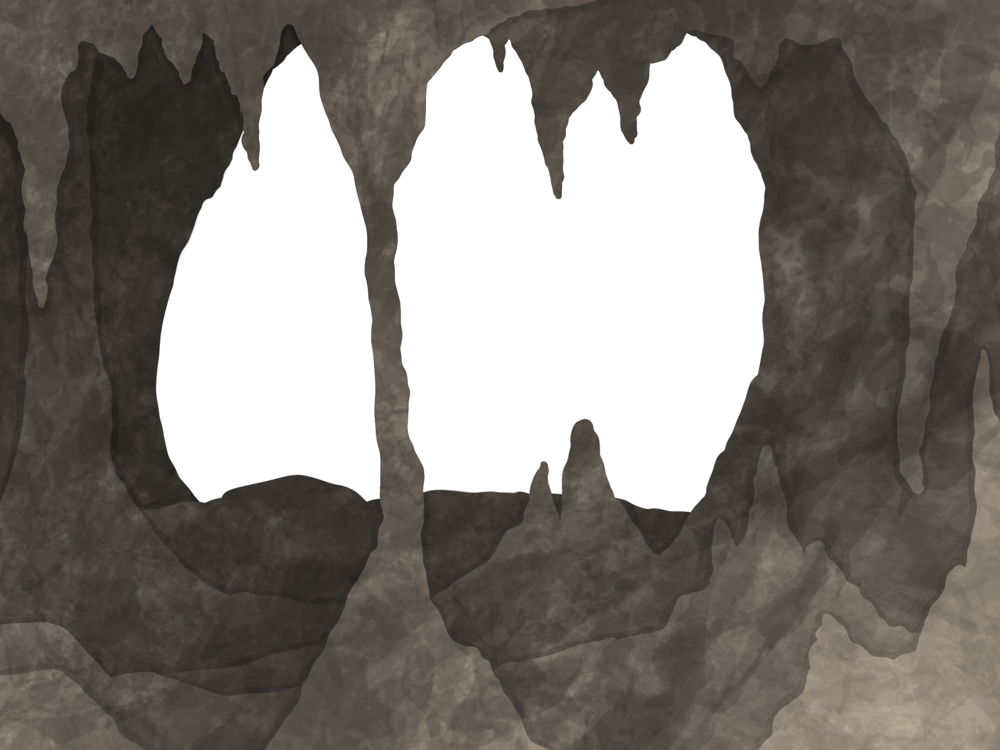
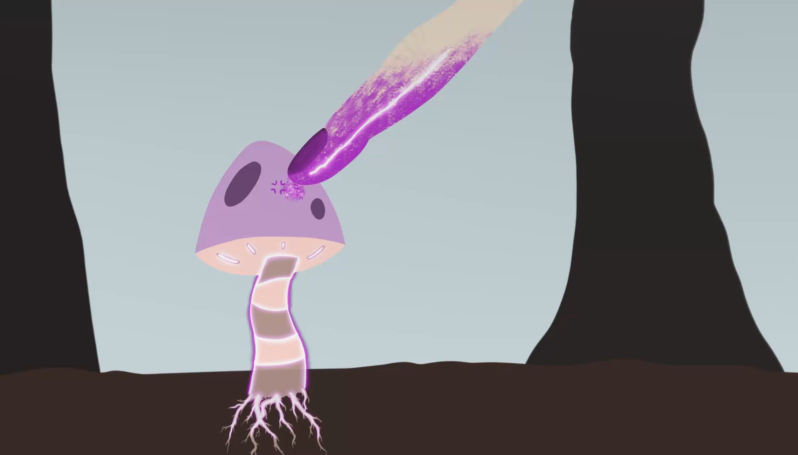
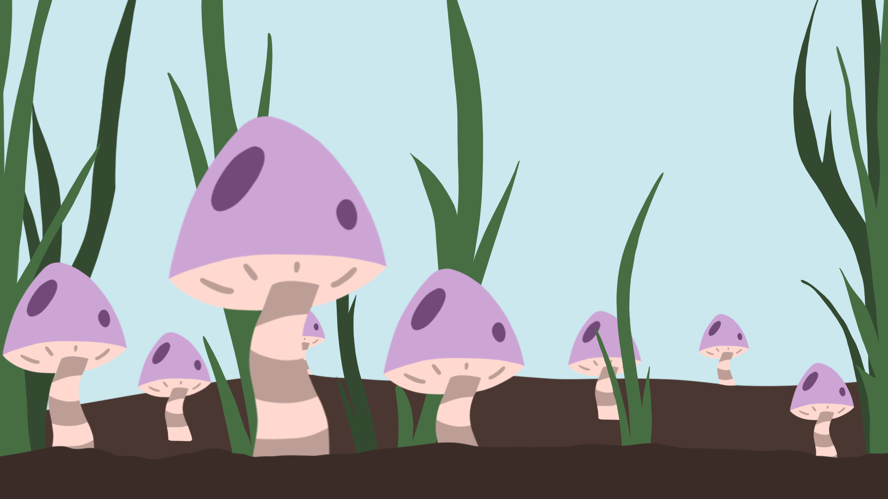
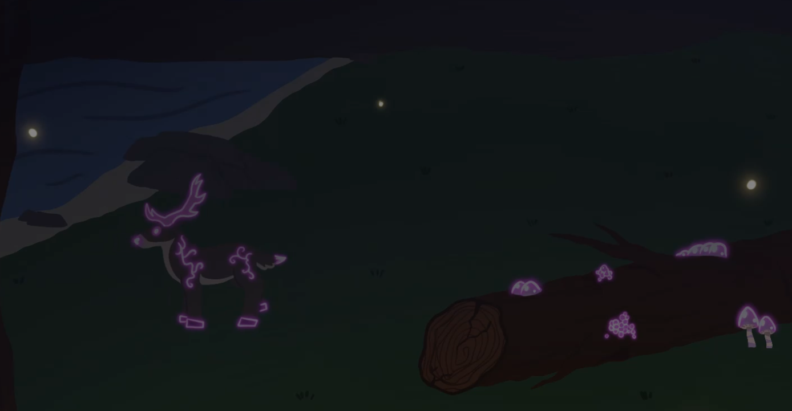
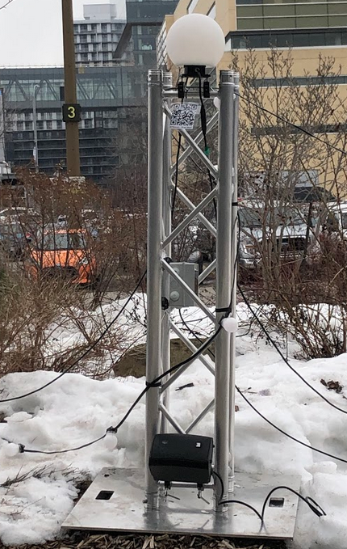

# Journal de Sabrina Laforest

* [Semaine 1](#semaine-1)
* [Semaine 2](#semaine-2)
* [Semaine 3](#semaine-3)
* [Semaine 4](#semaine-4)
* [Semaine 5](#semaine-5)
* [Semaine de rattrapage](#semaine-de-rattrapage)
* [Semaine 6](#semaine-6)
* [Semaine 7](#semaine-7)
* [Semaine 8](#semaine-8)

## Semaine 1

### Résumé des réalisations effectuées
- Retour sur le projet avec l'équipe; s'assurer d'avoir une vision commune 
- Ré-écriture de l'intention et du synopsis avec Alexandre
- Commencer a imaginer les vidéos pour les codes QR

### Est-ce que j'ai accompli l'ensemble des tâches et objectifs que je m'étais fixés pour cette semaine?	
- [ ] Complètement
- [x] Assez
- [ ] Peu
- [ ] Pas du tout

#### Décrivez pourquoi.
Étant donné que mes vidéos porteront sur tout les projets j'attends que les concepts des autres équipes soient presque finaliser. Donc je n'ai pas pu beaucoup avancer vu que la majorité des équipes repensent leur concepts et idées.

#### S'il y a lieu, qu'allez-vous faire pour remédier à la situation?
Il faut que je parle plus au autres équipes et voir où elles en sont avec leur idées. Je doit redoubler de créativité et d'originalité pour mes concepts (beaucoup de réflexions et moddboards a venir).

### Mon projet s'est-il réalisé selon l’échéancier prévu?

- [ ] Complètement
- [ ] Assez
- [x] Un peu
- [ ] Pas tout à fait

#### S'il y a des écarts, décrivez-les.
J'aurais préféré pouvoir commencer mes illustrations pour les vidéos a la semaine 2 et que la majorité des concepts pour celles-ci soient coulées dans le béton.

#### S'il y a lieu, qu'allez-vous faire pour remédier à la situation?
Il faut vraiment que je me décide sur mes concepts pour commencer les ''sketchs'' au minimum

### Défis pour la prochaine semaine
- Mettre a jour mes idées pour les vidéos
- Faire les moodboards pour chacunes d'entre elles 
- Faire des sketchs des éléments/personnages importants des vidéos (si possible aussi des scenes importantes)
- Ajouter plus d'élément sur ma partie du projet dans le document de préproduction

---
## Semaine 2
### Résumé des réalisations effectuées
- Population de la section 'Code QR' dans la préproduction
- Choix des thèmes/histoires/idées des vidéos
- Création des moodboards pour chaque vidéos
- Début des mini scénarios pour chaque vidéo d'animation

### Image d'une réalisation dont tu es la ou le plus fier

### Est-ce que j'ai accompli l'ensemble des tâches et objectifs que je m'étais fixés pour cette semaine?

- [ ] Complètement
- [x] Assez
- [ ] Peu
- [ ] Pas du tout

#### Décrivez pourquoi.
 Bien que j'ai fini mes moodboards avec les nouvelles idées il aurait été idéal d'avoir fini mes scénarios pour que tout soit concret/dans le béton. Les vidéos sont encore un peu dans les nuages (voir idées abstraites) vu que les scénario ne sont pas fini ce qui rend l'explications de celles-ci plus compliquées.

#### S'il y a lieu, qu'allez-vous faire pour remédier à la situation?
Voir les défis/tâches pour la semaine prochaine

### Mon projet s'est-il réalisé selon l’échéancier prévu?

- [ ] Complètement
- [x] Assez
- [ ] Un peu
- [ ] Pas tout à fait

#### S'il y a des écarts, décrivez-les.
Bien que j'aurais aimer avoir déjà commencer mes animation repenser les concepts de celles-ci ont prit plus de temps que prévu. Les concepts de vidéos ont passé d'histoires des autres projets finaux à l'histoire de nos sentiers lumineux/l'environnement de ceux-ci ce qui a pousser notre équipe a réfléchir sur qu'elle était l'intention réelle du projet si il n'y avait aucun autre projet de déployer en même temps. Après de longue discussions nous avons décider d'aller vers un 'Marais Fongique'.

#### S'il y a lieu, qu'allez-vous faire pour remédier à la situation?
Je dois prendre des décisions plus rapidement et en ce fait même commencer mes sketchs et animations. Je dois arrêter de douter de mes choix, car je me stoppe moi même dans mon avancement du projet en ayant peur de faire les mauvais choix (et que mon équipe soit mécontente de mes choix).

### Défis pour la prochaine semaine
- Faire le design final pour les champignons
- Finir les mini scénarios pour chaque animations + les séparer en différentes scènes (pour éviter d'avoir un fichier très lourd à exporter)
- Début des animations!!!

---
## Semaine 3 
### Résumé des réalisations effectuées
- Finir la population de la section 'Code QR' dans la préproduction
- Creation du logo du projet
- Debut de la baniere du projet
- Debut de la fiche informative sur le champignon
- Finition des mini scénarios pour chaque vidéo d'animation
- Participation au tournage de la video explicative
- Creation des issues dans le tableau des taches pour les animations
- Debut des animations!!! 

### Image d'une réalisation dont tu es la ou le plus fier

Bien qu'il n'y ai pas beaucoup de scenes je trouve que le message et les notes sont claires. J'ai pu inclure des elements qui m'interessent et me stimule j'ai tres hate de commence cette video! 

### Est-ce que j'ai accompli l'ensemble des tâches et objectifs que je m'étais fixés pour cette semaine?

- [ ] Complètement
- [x] Assez
- [ ] Peu
- [ ] Pas du tout

#### Décrivez pourquoi.
 Plusieurs nouvelles taches se sont ajoutees au fur de la semaine (logo, banieres, issues, etc). Toutefois, mes idees sont beaucoup plus claires que la semaine derniere, je pense que la creation des animations ira plus rapidement que prevu. Le design final pour le champignon est decide il ne manque plus que sa fiche explicative.

#### S'il y a lieu, qu'allez-vous faire pour remédier à la situation?
Bien que j'aurais prefere avoir deja commence mes animations je trouve avoir accompli assez de taches. Plus est toujours mieux mais je suis quand meme fiere de ce que j'ai fait.

### Mon projet s'est-il réalisé selon l’échéancier prévu?

- [ ] Complètement
- [x] Assez
- [ ] Un peu
- [ ] Pas tout à fait

#### S'il y a des écarts, décrivez-les.
Encore une fois, je suis techniquement (selon moi meme) en retard dans la production de mes animations.

#### S'il y a lieu, qu'allez-vous faire pour remédier à la situation?
Il faut que finisse rapidement la baniere et la fiche explicative pour pouvoir focuser seulement sur les animations.

### Défis pour la prochaine semaine
- Faire les issues pour l'association des codes QR et la creation des sites webs?
- Finir fiche explicative du champignon
- Finir la baniere pour le site web (timMomo)
- Debut des animations (a decide laquelle)

---
## Semaine 4
### Résumé des réalisations effectuées
- Finalisation des issues pour les animations et codes QR
- Finalisation des compositions visuelles pour l'animation Dimension Fongique
- Début de l'animation Dimension Fongique (scene 3 et 4)
- Début du prototypage pour les code QR/site webs via une vidéo 'Test'

### Image d'une réalisation dont tu es la ou le plus fier

J'ai adoré travailler sur la grotte pour la scène 3 de Dimension Fongique. Je ne suis pas à l'aise avec les environnements et je suis très heureuse du résultat. Avec le feedback de mes cooéquipiers j'ai pu ajouter des textures auquels je n'aurais pas penser.

### Est-ce que j'ai accompli l'ensemble des tâches et objectifs que je m'étais fixés pour cette semaine?

- [ ] Complètement
- [ ] Assez
- [ ] Peu
- [x] Pas du tout

#### Décrivez pourquoi.
 Vu que le nom du projet n'arrete pas de changer j'ai décidé de laisser tomber la banière et le logo. Ceux-ci seront créer plus tard pour éviter la perte de temps (en créer plusieurs pour rien). La fiche explicative du champignon n'a aussi pas été complétée. J'ai mis toute mon attention sur les animations à la place. De plus, le prototypage pour les codes QR se sont rajouter à la liste de tache. De plus, Jeudi passé je me suis coupée assez profondément au doigts ce qui a fait que je ne pouvais pas dessiner pendant quelques jours.

#### S'il y a lieu, qu'allez-vous faire pour remédier à la situation?
Tout le branding/le visuel du projet et du champignon sont remis à plus tard quand le nom du projet sera 'couler dans le béton' pour éviter de la perte de temps. 

### Mon projet s'est-il réalisé selon l’échéancier prévu?

- [ ] Complètement
- [ ] Assez
- [x] Un peu
- [ ] Pas tout à fait

#### S'il y a des écarts, décrivez-les.
Je pense ne pas être assez avancée dans mes animations vu la charge de travail à faire. Je pense que j'aurais dut avoir finit une animation mais ce n'est pas la cas. Le stress commence a se faire sentir !!! 

#### S'il y a lieu, qu'allez-vous faire pour remédier à la situation?
Chop Chop il faut que j'embreille et mette les bouchées doubles. J'ai trouvé de nouvelles techniques avec mon logiciel pour faire des effets plus rapidement alors sa devrait aider un peut au minimum.

### Défis pour la prochaine semaine
- Finir le prototypage des code QR/site webs 
- Finir l'animation Dimension Fongique (montage vidéo inclus)
- Débuter et Finir l'animation Fongvie (si possible?)

---
## Semaine 5
### Résumé des réalisations effectuées
- Prototypage des code QR/site webs 
- Terminer l'animation Dimension Fongique (montage vidéo inclus)
- Début de l'animation Fongvie 

### Image d'une réalisation dont tu es la ou le plus fier

Bien que je n'avais pas fini a temps l'animation je suis très heureuse du résultat et des effets

### Est-ce que j'ai accompli l'ensemble des tâches et objectifs que je m'étais fixés pour cette semaine?

- [ ] Complètement
- [ ] Assez
- [x] Peu
- [ ] Pas du tout

#### Décrivez pourquoi.
 Bien que j'ai fini l'animation Dimension Fongique le prototypage ne c'est pas très bien passé (le code QR à cesser de fonctionner et le site web fonctionne à moitie.) L'animation Fongvie a été commencé, mais pas finit. J'ai été malade au début de la semaine ce qui a mit un frein sur mon avancement.

#### S'il y a lieu, qu'allez-vous faire pour remédier à la situation?
Finir Fongvie; si je n'y arrive pas (perte d'idée/d'interet pour l'instant) débuter une autre animation pour perdre le moins de temps possible. 

### Mon projet s'est-il réalisé selon l’échéancier prévu?

- [ ] Complètement
- [ ] Assez
- [ ] Un peu
- [x] Pas tout à fait

#### S'il y a des écarts, décrivez-les.
Mon nouvel échéancier consistait de finir une animation par semaine. Je ne suis pas du tout rendue là, je n'ai pas réussi à rattraper mon retard en plus d'avoir été malade au début de la semaine ce qui m'a ralentie d'avantage dans mon travail.

#### S'il y a lieu, qu'allez-vous faire pour remédier à la situation?
Je risque de devoir demander de l'aide à mes cooéquipiers pour la partie des codes QR et du site web. Vu mon retard accumuler et le résultat de cette semaine avec mes prototypages il serait pratique d'avoir un autre cerveau pour voir pourquoi sa ne fonctionne pas correctement.

### Défis pour la prochaine semaine
- Finir l'animation Fongvie (montage vidéo inclus)
- Faire l'animation Terre Vs Fongique (montage vidéo inclus)

---
## Semaine de rattrapage
### Résumé des réalisations effectuées
- Continuation de l'animation Fongvie (montage vidéo inclus)
- Début de l'animation Terre Vs Fongique (montage vidéo inclus)

### Image d'une réalisation dont tu es la ou le plus fier

Je suis très heureuse de la composition finale; il y aura beaucoup plus de mouvement que dans le scénario original.

### Est-ce que j'ai accompli l'ensemble des tâches et objectifs que je m'étais fixés pour cette semaine?

- [ ] Complètement
- [ ] Assez
- [ ] Peu
- [x] Pas du tout

#### Décrivez pourquoi.
J'ai eu un 'down' au début de la semaine peu importe l'illustration j'en étais mécontente. A partir de Mercredi j'ai décidé de mettre de côté Fongvie et commencer VS. C'est aller beaucoup mieux j'ai repris de la vigueur et du goût a mes animations. 

#### S'il y a lieu, qu'allez-vous faire pour remédier à la situation?
Dès que sa ne va pas/que je bloque sur quelque chose; je change d'animation ou de scène. J'ai aussi trouver que faire des mini animations (moins d'une seconde), mais plus de montage sauve aussi beaucoup de temps et rend la tâche plus facile/agréable. Je me suis trouver des trucs et des brosses qui rendent mon travail plus simple et tout aussi beau! 

### Mon projet s'est-il réalisé selon l’échéancier prévu?

- [ ] Complètement
- [ ] Assez
- [ ] Un peu
- [x] Pas tout à fait

#### S'il y a des écarts, décrivez-les.
À ce point trois des quatres animations devraient être finit et prêtes (sans compter les détails supplémentaire si le temps le permet). Je n'ai qu'une seule animation finit et 2 à moitié finit...

#### S'il y a lieu, qu'allez-vous faire pour remédier à la situation?
Changement d'échéancier; si je bloque sur quoi que ce soit on passe au prochain pas de temps a perdre
- Mars 4-5: Prototypage code QR avec l'aide de mes cooéquipiers
- Finir l'animation VS avant dimanche 16h
- Possiblement retravailler l'idée de Fongvie car à l'instant je ne suis pas satisfaite et j'ai de la difficultée à avancer vu le manque d'intérêt enver celle-ci

### Défis pour la prochaine semaine
- Finir l'animation Fongvie (montage vidéo inclus)
- Avoir un nouveau prototype pour les code QR (utiliser DimensionFongique)
- Finir l'animation Terre Vs Fongique (montage vidéo inclus)
- Idéalement Faire au minimum 75% de l'animation Vie Nocturne

---
## Semaine 6
### Résumé des réalisations effectuées
- Finit l'animation Terre vs Fongique
- Finit l'animation Vie Nocturne
- Avancement de l'animation Fongvie 
- Nouveau prototype pour les codes QR

### Image d'une réalisation dont tu es la ou le plus fier

Vie Nocturne!!!! 

### Est-ce que j'ai accompli l'ensemble des tâches et objectifs que je m'étais fixés pour cette semaine?

- [x] Complètement
- [ ] Assez
- [ ] Peu
- [ ] Pas du tout

#### Décrivez pourquoi.
Pampam! J'ai finit deux animations cette semaine! Tres heureuse du resultat!!!! J'ai creer un nouveau repo et trouver un nouveau createur de code QR. Tout fonctionne tres bien pour l'instant! Suite a la recommandation de Guillaume, chaque animation est exportee en .mp4 et .mov pour que le navigateur de l'utilisateur choisisse le format qui fonctionne le mieux.

#### S'il y a lieu, qu'allez-vous faire pour remédier à la situation?

### Mon projet s'est-il réalisé selon l’échéancier prévu?

- [x] Complètement
- [ ] Assez
- [ ] Un peu
- [ ] Pas tout à fait

#### S'il y a des écarts, décrivez-les.
Il aurait ete ideal d'avoir finit toutes les animations, mais je suis assez avance (et mes defis de la semaine passee ont tous ete remplis(outre que j'ai change le pourcentage de finition de nocturne et fongvie))

#### S'il y a lieu, qu'allez-vous faire pour remédier à la situation?
Pour Fongvie je vais demander du feedback et des idees a nos professeurs car je n'arrive pas a trouver ce qu'il manque.

### Défis pour la prochaine semaine
- Finir l'animation Fongvie 
- Refaire le "branding" du projet :)
- Imprimer et laminer les codes QR (s'assurer qu'ils fonctionnent)
- Trouver des anneaux de metal pour pouvoir suspendre les codes QR imprimer

---
## Semaine 7
### Résumé des réalisations effectuées
- Finit l'animation Fongvie 
- Refait le "branding" du projet :)
- Imprimer et laminer les codes QR (s'assurer qu'ils fonctionnent)
- Installation des codes QR dans les sentiers

### Image d'une réalisation dont tu es la ou le plus fier

### Est-ce que j'ai accompli l'ensemble des tâches et objectifs que je m'étais fixés pour cette semaine?

- [x] Complètement
- [ ] Assez
- [ ] Peu
- [ ] Pas du tout

#### Décrivez pourquoi.
 Tout ce qui etait a faire a ete effectuer et completer! Je suis tres heureuse du resultat final!!!
 J'ai aussi imprimer et laminer des extra de chaque code QR au cas ou certains seraient arrache/vole

#### S'il y a lieu, qu'allez-vous faire pour remédier à la situation?
n/a

### Mon projet s'est-il réalisé selon l’échéancier prévu?

- [x] Complètement
- [ ] Assez
- [ ] Un peu
- [ ] Pas tout à fait

#### S'il y a des écarts, décrivez-les.
n/a

#### S'il y a lieu, qu'allez-vous faire pour remédier à la situation?
n/a

### Défis pour la prochaine semaine
- M'assurer que le tout fonctionne bien jusqu'a la presentation finale
- Filmer la nouvelle video avec l'equipe qui sera presente lors du vernissage
- Remplace les code QR si certain dissparaissent

## Semaine 8
Presentation finale/Vernissage des projets!
