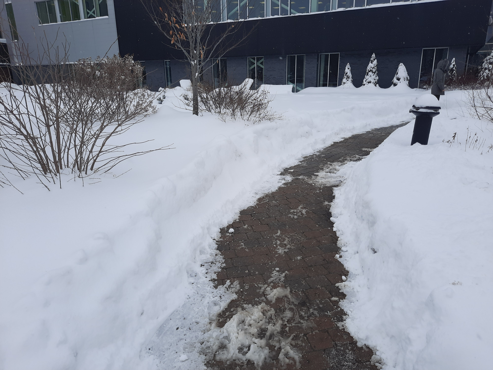
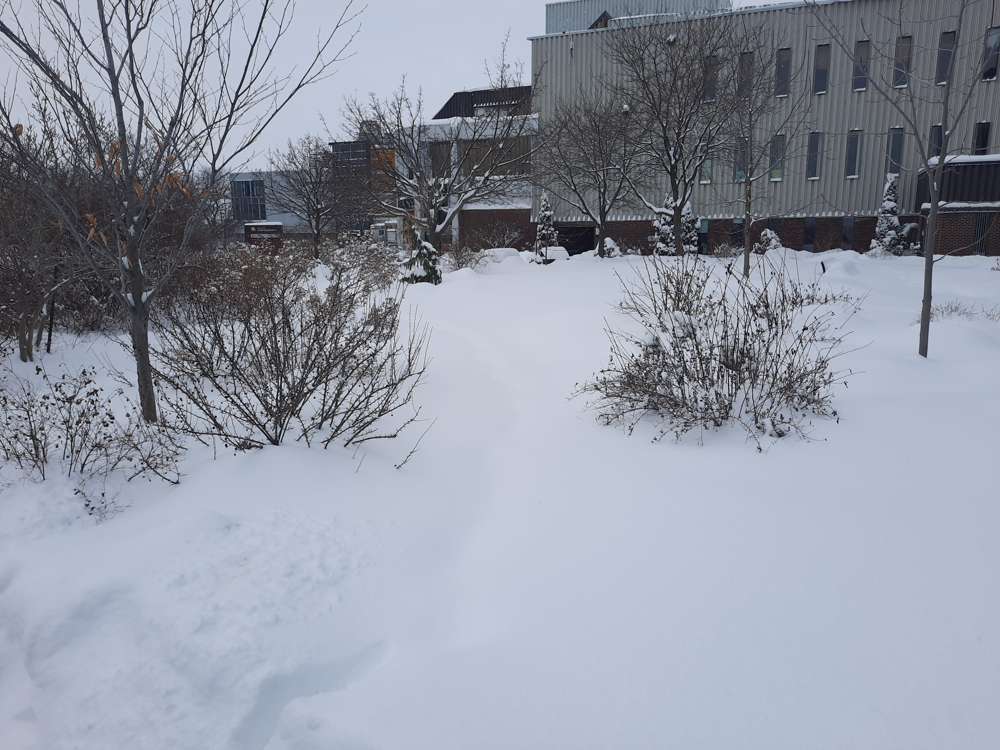
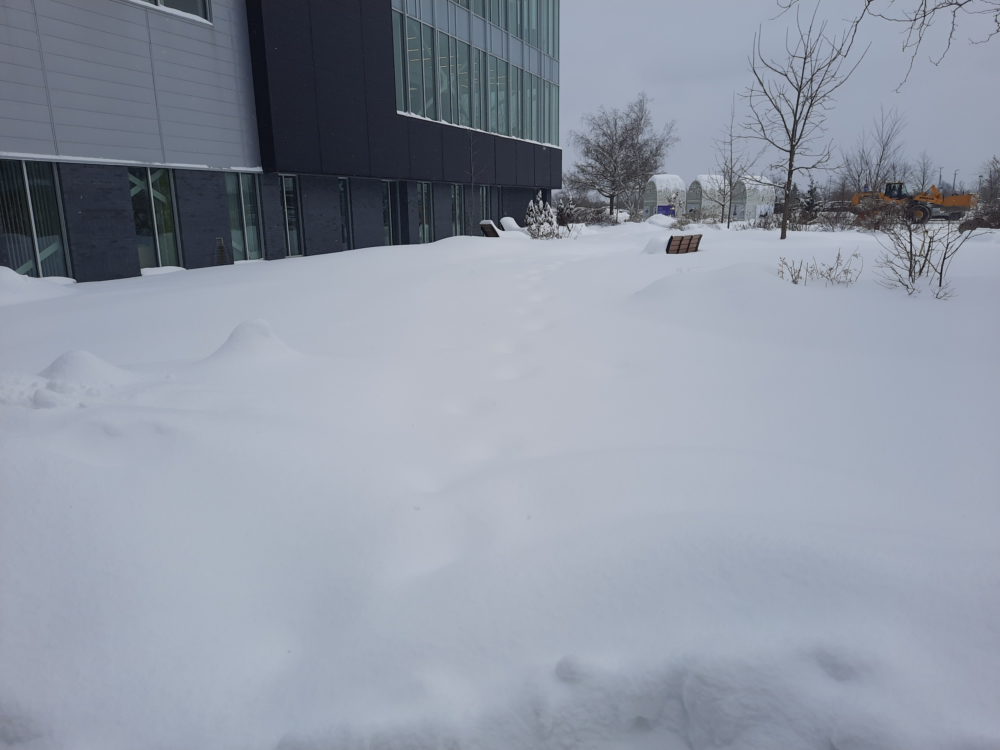
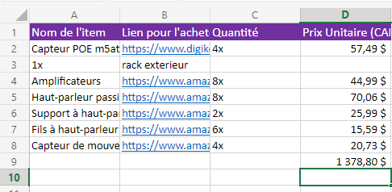
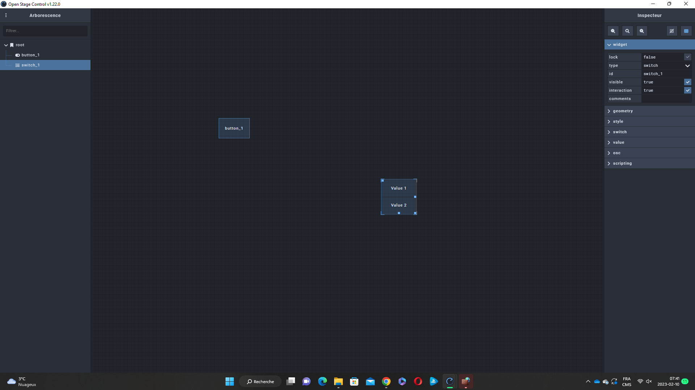
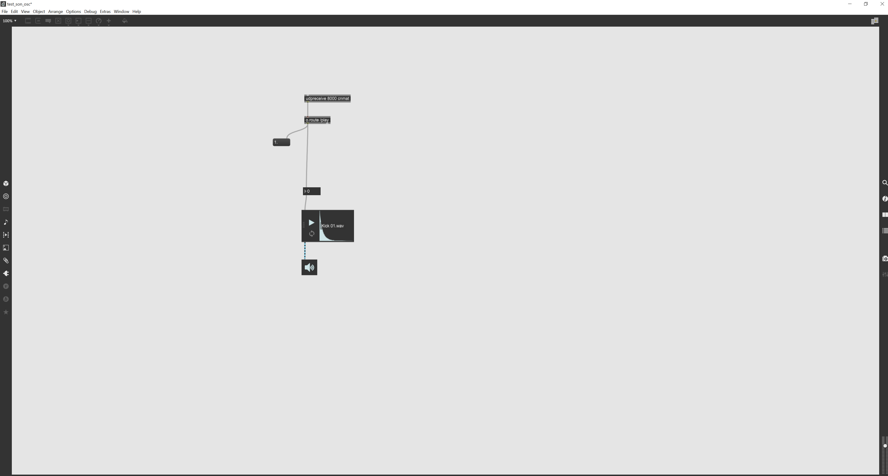
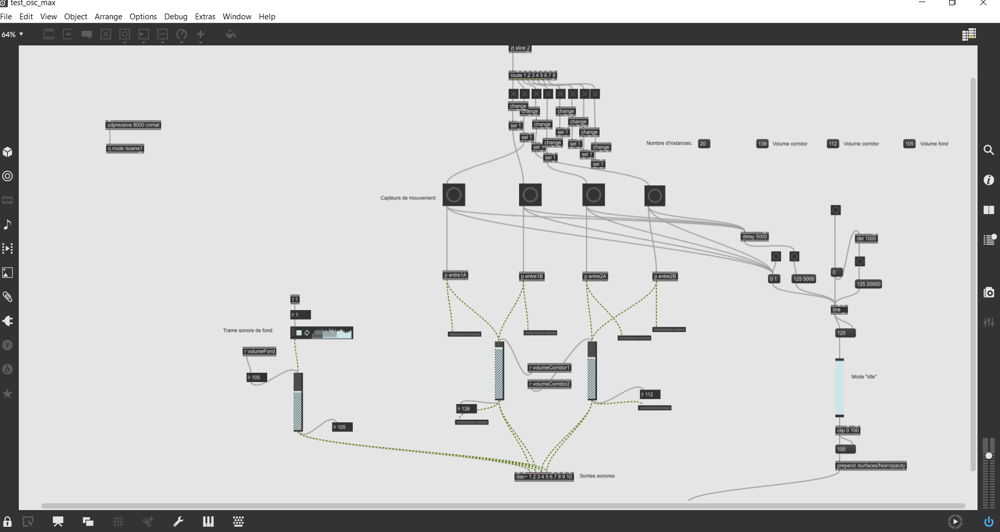

# Journal de Sébastien Reilly

* [Semaine 1](#semaine-1)
* [Semaine 2](#semaine-2)
* [Semaine 3](#semaine-3)
* [Semaine 4](#semaine-4)
* [Semaine 5](#semaine-5)
* [Semaine de rattrapage](#semaine-de-rattrapage)
* [Semaine 6](#semaine-6)
* [Semaine 7](#semaine-7)
* [Semaine 8](#semaine-8)
* [Semaine 9](#semaine-9)

## Semaine 1

### Résumé des réalisations effectuées
- J'ai attribué les différents rôles que chaque personne allait jouer dans l'équipe.
- J'ai retravaillé une partie du document de la préproduction, spécialement les liens vers les tâches et l'échéancier.
- J'ai créé plusieurs "milestone" pour nous permetttre de suivre un échéancier. 
- J'ai commencé à assigner des tâche dans le tableau de tâche.
- J'ai arrangé le schéma de branchement du document de préproduction.
- Je me suis assuré que la table des matières du document de préproduction fonctionne correctement.
- Moi et mon équipe avont déterminé le matériel requis pour le projet.
- J'ai fait du repérage sur les lieux du site.

### Image d'une réalisation dont tu es la ou le plus fier

ou

ou

### Est-ce que j'ai accompli l'ensemble des tâches et objectifs que je m'étais fixés pour cette semaine?	
- [x] Complètement
- [ ] Assez
- [ ] Peu
- [ ] Pas du tout

#### Décrivez pourquoi.
Ma gestion du temps fut optimale et l'ensemble des tâches que je m'étais fixés ont été réalisés.

#### S'il y a lieu, qu'allez-vous faire pour remédier à la situation?
Ne s'applique pas.

### Mon projet s'est-il réalisé selon l’échéancier prévu?

- [ ] Complètement
- [x] Assez
- [ ] Un peu
- [ ] Pas tout à fait

#### S'il y a des écarts, décrivez-les.
L'échéancier pour les tâches de cette semaine a été respecté. Cependant, j'aurais aimé prendre de l'avance sur la semaine prochaine.

#### S'il y a lieu, qu'allez-vous faire pour remédier à la situation?
Ne s'applique pas vraiment, ceci-dit rester plus longtemps au collège ne ferais pas de mal.

### Défis pour la prochaine semaine
Mon défi pour la semaine prochaine est de mettre à jour le budget du projet.

---
## Semaine 2
### Résumé des réalisations effectuées
- J'ai créé une nouvelle section dans le document de préproduction pour intégrer plus facilement les codes QR.
- Nous avons repenser en équipe du matériel que nous allions utilisé.
- J'ai créé et rempli la section dédiée au matériel dans le document Excel.
- Nous avons faite une première vidéo de présentation de la préproduction.
- J'ai établi un premier budget.

### Image d'une réalisation dont tu es la ou le plus fier

### Est-ce que j'ai accompli l'ensemble des tâches et objectifs que je m'étais fixés pour cette semaine?

- [ ] Complètement
- [X] Assez
- [ ] Peu
- [ ] Pas du tout

#### Décrivez pourquoi.
 J'ai accompli l'essentiel des tâches que je m'étais fixées pour cette semaine. Cependant, il me reste encore à refaire le schéma de branchement.

#### S'il y a lieu, qu'allez-vous faire pour remédier à la situation?
Ce sera la première tâche que je ferai avant lundi prochain.

### Mon projet s'est-il réalisé selon l’échéancier prévu?

- [x] Complètement
- [ ] Assez
- [ ] Un peu
- [ ] Pas tout à fait

#### S'il y a des écarts, décrivez-les.
Ne s'applique pas.

#### S'il y a lieu, qu'allez-vous faire pour remédier à la situation?
Ne s'applique pas.

### Défis pour la prochaine semaine
- Refaire la vidéo de présentation de la préproduction avant lundi.
- Vérifier que le site web fonctionne comme il se doit.

---
## Semaine 3 
### Résumé des réalisations effectuées
-J'ai commencer à me familiariser avec Madmapper
-J'ai découvert Open Stage Control et réussit à le faire interagir avec Madmapper
-Je me suis assuré que la navigation sur le site web fonctionne
-Nous avons refaite la vidéo de présentation de la préproduction
-Nous avons pris connaissance de la grosseur des boules lumineuses et avons changer le plan en conséquence

### Image d'une réalisation dont tu es la ou le plus fier

### Est-ce que j'ai accompli l'ensemble des tâches et objectifs que je m'étais fixés pour cette semaine?

- [ ] Complètement
- [ ] Assez
- [x] Peu
- [ ] Pas du tout

#### Décrivez pourquoi.
 Même si les tâches que je m'étais fixé pour cette semaine sont faites, j'ai l'impression d'avoir travaillé moins fort cette semaine. J'ai manqué une journée à cause que j'étais malade et j'ai eu de la misère à rattraper.

#### S'il y a lieu, qu'allez-vous faire pour remédier à la situation?
Essayer de ne pas être malade et de travailler plus fort.

### Mon projet s'est-il réalisé selon l’échéancier prévu?

- [ ] Complètement
- [x] Assez
- [ ] Un peu
- [ ] Pas tout à fait

#### S'il y a des écarts, décrivez-les.
Il n'y a pas eu d'écart.

#### S'il y a lieu, qu'allez-vous faire pour remédier à la situation?
Ne s'applique pas.

### Défis pour la prochaine semaine
- Commencer à travailler avec Max msp.
- Continuer les tests avec les lumières.

---
## Semaine 4
### Résumé des réalisations effectuées

- J'ai réalisé un gestionnaire audio à l'aide de Max msp.
- J'ai aidé à faire allumer nos lumières à l'aide de Madmapper.
- J'ai été en mesure de simuler une interaction à l'aide d'Open Stage Control.

### Image d'une réalisation dont tu es la ou le plus fier

### Est-ce que j'ai accompli l'ensemble des tâches et objectifs que je m'étais fixés pour cette semaine?

- [X] Complètement
- [ ] Assez
- [ ] Peu
- [ ] Pas du tout

#### Décrivez pourquoi.

L'ensemble des tâches que je m'étais fixée pour cette semaine a été réalisé. Nous avons d'ailleurs un premier prototype.

#### S'il y a lieu, qu'allez-vous faire pour remédier à la situation?

Ne s'applique pas.

### Mon projet s'est-il réalisé selon l’échéancier prévu?

- [X] Complètement
- [ ] Assez
- [ ] Un peu
- [ ] Pas tout à fait

#### S'il y a des écarts, décrivez-les.

Ne s'appilique pas.

#### S'il y a lieu, qu'allez-vous faire pour remédier à la situation?

Ne s'applique pas.

### Défis pour la prochaine semaine

Commencer à travailler avec le capteur de mouvement.

---
## Semaine 5
### Résumé des réalisations effectuées
- Avec l'aide de nos ressources humaine, j'ai modifié le patcher max pour qu'il fonctionne avec les capteurs de mouvements.
- Avec l'aide de nos ressources humaine, j'ai fait en sorte que le son et la lumière ne se coupe pas quand un capteur est déclenché.

### Image d'une réalisation dont tu es la ou le plus fier

### Est-ce que j'ai accompli l'ensemble des tâches et objectifs que je m'étais fixés pour cette semaine?

- [X] Complètement
- [ ] Assez
- [ ] Peu
- [ ] Pas du tout

#### Décrivez pourquoi.
Mon objectif pour cette semaine était de faire fonctionner le tout avec des capteurs de mouvements. J'ai réussis à les faire fonctionner et nous avons un premier prototype.

#### S'il y a lieu, qu'allez-vous faire pour remédier à la situation?
Ne s'applique pas.

### Mon projet s'est-il réalisé selon l’échéancier prévu?

- [X] Complètement
- [ ] Assez
- [ ] Un peu
- [ ] Pas tout à fait

#### S'il y a des écarts, décrivez-les.
Ne s'applique pas.

#### S'il y a lieu, qu'allez-vous faire pour remédier à la situation?
Ne s'applique pas.

### Défis pour la prochaine semaine
Faire en sorte que le prototype fonctionne entièrement en Art-Net.

---
## Semaine de rattrapage
### Résumé des réalisations effectuées

### Image d'une réalisation dont tu es la ou le plus fier

### Est-ce que j'ai accompli l'ensemble des tâches et objectifs que je m'étais fixés pour cette semaine?

- [ ] Complètement
- [ ] Assez
- [ ] Peu
- [ ] Pas du tout

#### Décrivez pourquoi.
 

#### S'il y a lieu, qu'allez-vous faire pour remédier à la situation?

### Mon projet s'est-il réalisé selon l’échéancier prévu?

- [ ] Complètement
- [ ] Assez
- [ ] Un peu
- [ ] Pas tout à fait

#### S'il y a des écarts, décrivez-les.

#### S'il y a lieu, qu'allez-vous faire pour remédier à la situation?

### Défis pour la prochaine semaine

---
## Semaine 6
### Résumé des réalisations effectuées

### Image d'une réalisation dont tu es la ou le plus fier

### Est-ce que j'ai accompli l'ensemble des tâches et objectifs que je m'étais fixés pour cette semaine?

- [ ] Complètement
- [ ] Assez
- [ ] Peu
- [ ] Pas du tout

#### Décrivez pourquoi.
 

#### S'il y a lieu, qu'allez-vous faire pour remédier à la situation?

### Mon projet s'est-il réalisé selon l’échéancier prévu?

- [ ] Complètement
- [ ] Assez
- [ ] Un peu
- [ ] Pas tout à fait

#### S'il y a des écarts, décrivez-les.

#### S'il y a lieu, qu'allez-vous faire pour remédier à la situation?

### Défis pour la prochaine semaine

---
## Semaine 7
### Résumé des réalisations effectuées

### Image d'une réalisation dont tu es la ou le plus fier

### Est-ce que j'ai accompli l'ensemble des tâches et objectifs que je m'étais fixés pour cette semaine?

- [ ] Complètement
- [ ] Assez
- [ ] Peu
- [ ] Pas du tout

#### Décrivez pourquoi.
 

#### S'il y a lieu, qu'allez-vous faire pour remédier à la situation?

### Mon projet s'est-il réalisé selon l’échéancier prévu?

- [ ] Complètement
- [ ] Assez
- [ ] Un peu
- [ ] Pas tout à fait

#### S'il y a des écarts, décrivez-les.

#### S'il y a lieu, qu'allez-vous faire pour remédier à la situation?

### Défis pour la prochaine semaine

## Semaine 8

## Semaine 9
