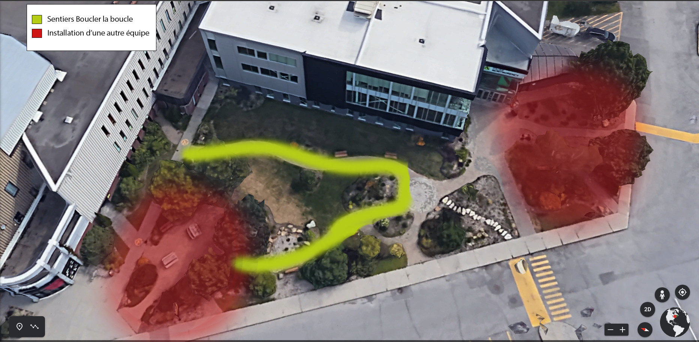
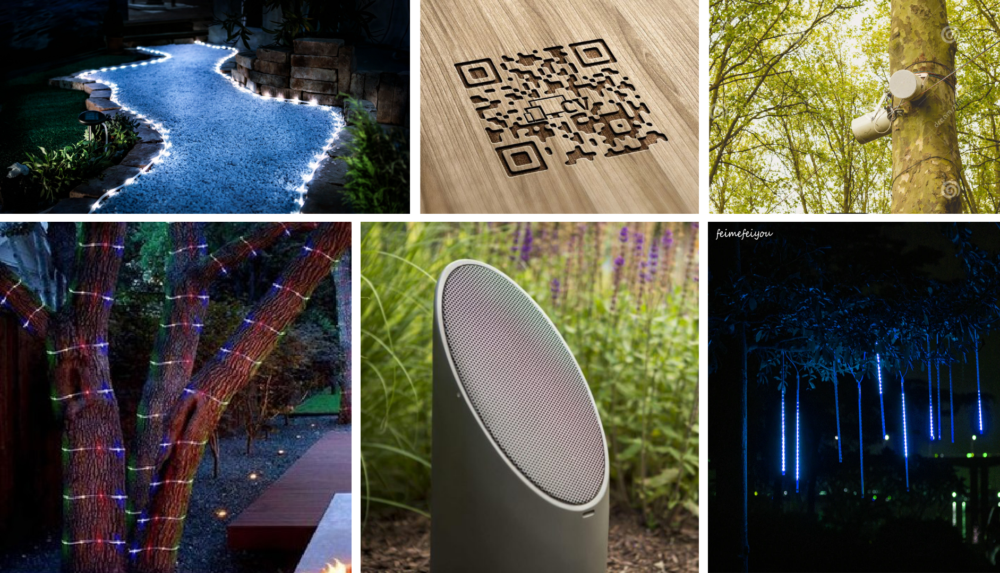
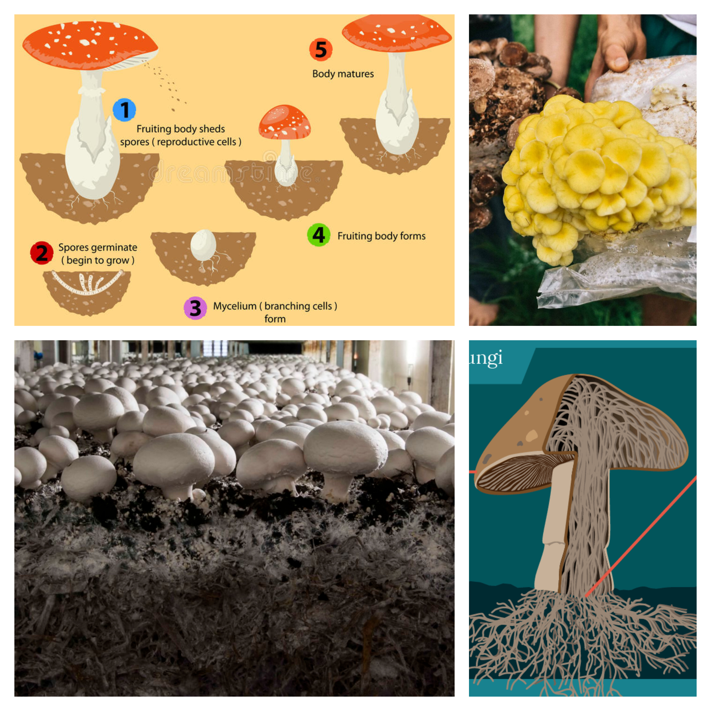
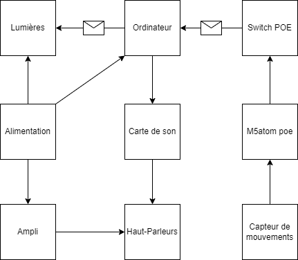
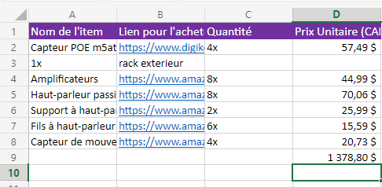

# Préproduction
> C'est ici qu'on dépose les éléments de la préproduction.

# Table des matières
1. [Intention ou concept](#Intention-ou-concept)
    - [Cartographie](#Cartographie)
    - [Intention de départ](#Intention-de-départ)
    - [Synopsis](#Synopsis)
    - [Tableau d'ambiance (*moodboard*)](#Tableau-dambiance-moodboard)
    - [Scénario, scénarimage ou document audio/visuel](#Scénario-scénarimage-ou-document-audiovisuel)
2. [Contenu multimédia à intégrer](#Contenu-multimédia-à-intégrer)
    - [Utilisation des codes QR](#Utilisation-des-codes-QR)
    - [Inventaire du contenu multimédia](#Inventaire-du-contenu-multimédia)
    - [Univers artistique des éléments](#Univers-artistique-des-éléments)
3. [Planification technique d'un prototype (devis technique)](#Planification-technique-dun-prototype-devis-technique)
    - [Schémas ou plans techniques](#Schémas-ou-plans-techniques)
    - [Matériel de scénographie requis](#Matériel-de-scénographie-requis)
    - [Équipements requis](#Équipements-requis)
    - [Logiciels requis](#Logiciels-requis)
    - [Ressources humaines requises](#Ressources-humaines-requises)
    - [Ressources spatiales requises (rangement et locaux)](#Ressources-spatiales-requises-rangement-et-locaux)
    - [Contraintes techniques et potentiels problèmes de production](#Contraintes-techniques-et-potentiels-problèmes-de-production)
4. [Planification de la production d'un prototype (budget et étapes de réalisation)](#Planification-de-la-production-dun-prototype-budget-et-étapes-de-réalisation)
    - [Budget prévisionnel](#Budget-prévisionnel)
    - [Échéancier global](#Échéancier-global)
    - [Liste des tâches à réaliser](#Liste-des-tâches-à-réaliser)
    - [Rôles et responsabilités des membres de l'équipe](#Rôles-et-responsabilités-des-membres-de-léquipe)
    - [Moments des rencontres d'équipe](#Moments-des-rencontres-déquipe)

# Intention ou concept
[Vidéo d'intention](https://youtu.be/nYPI3L1SCVM)
## Cartographie
> Exemples:
 

## Intention de départ
Cet expérience a pour but d'immerger le visiteur dans une ambiance surréelle aux apparences marécageuse et de faire ressentir la sérénité de cette dernière.

## Synopsis
Les visiteurs empruntent ce sentier illuminé. Lors de leurs déplacements, ceux-ci se rendent compte que le sentier interagit à leurs passages; les lumières commencent à scintiller et les sons s'intensifient pour donner un sentiment serein. Dans le chemin lumineux se trouve des codes QR qui, une fois scannés, présentent une animation qui montrant la vie dans ce marais.

## Tableau d'ambiance (*moodboard*)
> Ajoutez ici une liste d'images, de vidéos, de documents audios ou multimédias qui vous inspirent. Une palette de couleur ainsi qu'un choix de typographie devraient également s'y trouver selon la nature du projet.

[Exemple d'animation de lumière](https://www.youtube.com/watch?v=578hrnxruuI)

> Insérez directement des captures d'écran et liens vers des médias ici.

[Exemple de tableaux d'ambiance visuels (images, couleurs, typographie)](https://cmontmorency365.sharepoint.com/sites/TIM-58266B-Expriencemultimdiainteractive-Enseignants/Documents%20partages/Enseignants/hiv2021_expMulti_582-66BMO/4_Contenu/Modeles/tableau_ambiance/1_tableau_ambiance_exemple.pdf)

## Scénario, scénarimage ou document audio/visuel 
<!--Quand l'installation ne détecte rien, les lampes sont dans un état de veille. Les lumières ne font qu'un faible clignotement. 

Lorsqu'un sujet va rentrer dans le passage, les lumières vont réagir à sa présence. Les haut-parleurs vont changer légèrement l'ambiance sonore. Les lumières vont guider le visiteur vers l'installation suivante. 

C'est la même chose dans l'autre sens... 

...Et dans le sentier au-dessus. 

Le visiteur remarquera aussi des codes QR à travers le parcours. Il peut scanner les codes afin de voir des animations sur les installations.-->

# Contenu multimédia
## Utilisation des codes QR
> Description de comment les codes QR seront utilisés dans le projet et qu'est-ce que ceux-ci apportent au projet.

Lorsque l'utilisateur scanne un des codes QR avec sont téléphone intelligent, celui-ci sera redirigé vers une page web qui affiche l'une des vidéos d'animations. Les animations en 2D illustrent l'univers fongique duquels c'est inspiré les sentiers lumineux. 

> Insertion d'images permettant d'appuyer la description (MoodBoard).

[Dimension Fongique - Scenario](https://github.com/Boucle-RDDL/Boucler-la-boucle/blob/main/docs/preproduction/medias/dimension_scenario.png)
\
[Vie Nocturne - Scenario](https://github.com/Boucle-RDDL/Boucler-la-boucle/blob/main/docs/preproduction/medias/vieNocturne_scenario.png)

[Terre VS Fongique- Scenario](https://github.com/Boucle-RDDL/Boucler-la-boucle/blob/main/docs/preproduction/medias/vs_scenario.png)

[Fongvie - Scenario](https://github.com/Boucle-RDDL/Boucler-la-boucle/blob/main/docs/preproduction/medias/fongvie_scenario.png)

## Inventaire du contenu multimédia

- 4 pages web
- 4 vidéos d'animation 2D
- 2 paysages sonores
- 2 univers colorés illuminés

Pour plus de détails: [Inventaire du contenu à intégrer](https://cmontmorency365-my.sharepoint.com/:x:/g/personal/1908085_cmontmorency_qc_ca/EZIX9bjE7GFFnLSn6LHiPbQBZes7pXdaC9Jnwa10zP01_w?wdOrigin=TEAMS-ELECTRON.p2p.p2p&wdExp=TEAMS-CONTROL&wdhostclicktime=1675177357904&web=1)

## Univers artistique des éléments
Exemples: 
    - [Light Walk Project](https://www.youtube.com/watch?v=jSrhLRTffrM&ab_channel=UrukiaMagazine) 
    - [Exemple de projet cr34te 1](https://cmontmorency365.sharepoint.com/:i:/s/TIMH23-58266B-Expriencemultimdiainteractivecopier/EY4aOW37TLVNh72izw-SoCoB6E5DdkiLFSTrh0d6RxYDTQ?e=hg7QoH) 
    - [Exemple de projet cr34te 2](https://cmontmorency365.sharepoint.com/:i:/s/TIMH23-58266B-Expriencemultimdiainteractivecopier/Eanpu6OrqrBLk1bsARDwz_gB6l0o3f3K2gj0bxMGrFXFZQ?e=O4kke9) 
    - ["Les Sentiers Lumineux de Noël" du Parc Floral de Paris](https://parissecret.com/wp-content/uploads/2022/10/PA22-GalleryHR-8-1024x722.jpg) 
    - [Style rechercher pour les vidéos d'animations](https://www.behance.net/gallery/111130733/SWAMP?tracking_source=search_projects_null) 

# Planification technique d'un prototype (devis technique)
## Schémas ou plans techniques
> Insérer plans, documents et schémas pertinents dans cette section.  

### Plantation 

### Schéma de branchement

## Matériel de scénographie requis

> Liste des matériaux de scénographie (matériaux de décor) requis ou lien vers un tableur Excel ou document Markdown à part si nécessaire (quantité, spécifications techniques, lien vers fiche technique si applicable, commentaires...)

* 4 pages web

* 4 videos d'animations 2D (image par image)

* 2 ambiances sonores

* 4 panneaux avec code QR

## Équipements requis
> Liste des équipements requis par département ou lien vers un tableur Excel ou document Markdown à part si nécessaire (quantité, spécifications techniques, lien vers fiche technique si applicable, commentaires...)

* Audio
    * 8 haut-parleurs passifs de 4"
    * 8 amplis ip65
    * 1 carte de son 8 entrés

* Lumière
    * 200' strings festoon
    * 15 boules lumineuse 200 mm ip65
    * 11 boules lumineuses 36" ip65
    
* Électricité
    * Alimentation électrique
    * 4 capteurs de mouvements
    * 4 m5atom poe
    * 1 switch poe
    * Fils à haut-parleur 2 x 30m, 2 x 25m, 3 x 15m, 1 x 10m

* Autre
    * 1 Macmini
    * 8 supports à haut-parleur
    * 22 ponts d'éclairage 1m
    * 4 ponts d'éclairage 2m

Pour plus de détails: [Inventaire du contenu à intégrer](https://cmontmorency365-my.sharepoint.com/:x:/g/personal/1908085_cmontmorency_qc_ca/EZIX9bjE7GFFnLSn6LHiPbQBZes7pXdaC9Jnwa10zP01_w?wdOrigin=TEAMS-ELECTRON.p2p.p2p&wdExp=TEAMS-CONTROL&wdhostclicktime=1675177357904&web=1)

## Logiciels requis
> Liste des logiciels requis, version ainsi que leurs dépendences

* [QLC+](https://www.qlcplus.org/)
* [Reaper](https://www.reaper.fm/)
* [Procreate](https://procreate.com/)
* [DaVinci Resolve](https://www.blackmagicdesign.com/ca/products/davinciresolve/)

## Ressources humaines requises
> Formaté en liste ou en lien vers un tableur Excel.

* TTP
    - William Racine
* Superviseurs
    - Daryl Hubert
    - Guillaume Arseneault
    - Lora Boisvert

## Ressources spatiales requises (rangement et locaux)
> Spécifications des espaces nécessaires formaté en liste ou lien vers un tableur Excel.

* Grand studio
    * Des codes QR à l'entré de chaque installation

* L'aménagement paysagé en diagonal de l'entré de la salle André-Mathieu
    * L'illumination des sentiers
    * La disposition de panneaux avec code QR dans les sentiers

## Contraintes techniques et potentiels problèmes de production
> Tableau ou lien vers un tableur Excel (contraintes, problème et solution envisagée, commentaires...)

| Contrainte ou problème potentiel                 | Solution envisagée                                    | Commentaires                                                                                 |
|--------------------------------------------------|-------------------------------------------------------|----------------------------------------------------------------------------------------------|
| La température hivernale                         | Isoler correctement le matériel                       | Nous pourrions toujours utiliser du matériel résistant à l'eau et aux températures variante  |
| La détection des passants se fait mal            | Ajuster l'échelle de donnée                           | Nous pourrions ainsi mieux contrôler les données qu'on reçoit|
| Les sites web qui ne marchent pas                | S'assurer de faire des examens diagnostiques          | Nous pourrions aussi faire un github pour s'assurer que chaque membre puissent contribuer    |

# Planification de la production d'un prototype (budget et étapes de réalisation)
## Budget prévisionnel

## Échéancier global
Étapes importantes du projet visualisé dans GitHub (*milestones*):  
https://github.com/Boucle-RDDL/Boucler-la-boucle/milestones

*Dates importantes :*
- Première itération : Mardi 24 janvier
- Prototype final :  Mardi 21 février
- Présentation des projets devant public : jeudi 23 mars (soir)

## Liste des tâches à réaliser
Visualisation des tâches à réaliser dans GitHub selon la méthode Kanban:  
https://github.com/orgs/Boucle-RDDL/projects/4

Inventaire des tâches à réaliser dans GitHub selon le répertoire d'*issues*:  
https://github.com/Boucle-RDDL/Boucler-la-boucle/issues

## Rôles et responsabilités des membres de l'équipe
> Il est proposé ici de nommer une personne à la coordination générale du projet, à la coordination technique et à la coordination artistique. Les grandes décisions sur les grandes orientations du projet se prendront en groupe lors des rencontres d'équipe. Cependant, les décisions entre les rencontres de groupe appartiendront à ces personnes.

**Sabrina Laforest**
- Responsable des codes QR;
- Créatrice des vidéos d'animations 2D image par image;
- Monteuse des vidéos d'animations;

Liste des tâches dans Git Hub:  
https://github.com/Boucle-RDDL/Boucler-la-boucle/issues/assigned/SabrinaLaforest 
https://github.com/orgs/Boucle-RDDL/projects/4/views/1?filterQuery=assignee%3ASabrinaLaforest

**Sébastien Reilly**
- Coordonnateur général du projet (coordination de l'échéancier, du budget, suivi de la liste des tâches à réaliser, s'assurer de la répartition du rôle et des responsabilités des membres de l'équipe);
- Programmeur;
- Opérateur web;
- Installation de l'équipement dans l'espace physique.

Liste des tâches dans Git Hub:  
https://github.com/Boucle-RDDL/Boucler-la-boucle/issues/assigned/sebreilly 
https://github.com/orgs/Boucle-RDDL/projects/4/views/1?filterQuery=assignee%3Asebreilly

**Maxime Des Lauriers**
- Création des paysages sonores sonores;
- Coordonnateur technique (suivi du devis technique);
- Opérateur web;
- Installation de l'équipement dans l'espace physique.

Liste des tâches dans Git Hub:  
https://github.com/Boucle-RDDL/Boucler-la-boucle/issues/assigned/MDLauriers36 
https://github.com/orgs/Boucle-RDDL/projects/4/views/1?filterQuery=assignee%3AMDLauriers36

**Alexandre Daniel**
- Coordonnateur artistique (attention plus particulière pour s'assurer que l'intention/concept artistique du projet initial reste, sinon consulter les membres de l'équipe);
- Installation de l'équipement dans l'espace physique.

Liste des tâches dans Git Hub:  
https://github.com/Boucle-RDDL/Boucler-la-boucle/issues/assigned/AlexDan26 
https://github.com/orgs/Boucle-RDDL/projects/4/views/1?filterQuery=assignee%3AAlexDan26

**Tâches pas encore attribuées**  
https://github.com/orgs/Boucle-RDDL/projects/4/views/1?filterQuery=no%3Aassignee

## Moments des rencontres d'équipe
Hebdomadaire
- **40h sur 5 jour, par semaine**: Instalation du projet (peut varier selon l'horaire de l'équipe).

Autre: 
- ** 2h par semaine** : Rencontre de suivi de projet sur Microsoft Teams/Discord.
