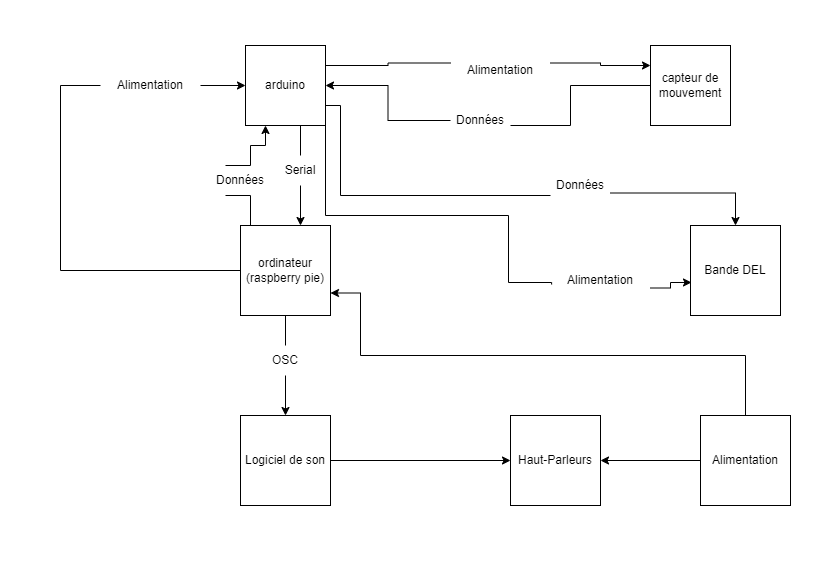

# Préproduction
> C'est ici qu'on dépose les éléments de la préproduction.

# Table des matières
1. [Intention ou concept](#Intention-ou-concept)
    - [Cartographie](#Cartographie)
    - [Intention de départ](#Intention-de-départ)
    - [Synopsis](#Synopsis)
    - [Tableau d'ambiance (*moodboard*)](#Tableau-d'ambiance-(*moodboard*))
    - [Scénario, scénarimage ou document audio/visuel](#Scénario,-scénarimage-ou-document-audio/visuel)
2. [Contenu multimédia à intégrer](#Contenu-multimédia-à-intégrer)
    - [Inventaire du contenu multimédia](#Inventaire-du-contenu-multimédia)
    - [Univers artistique des éléments](#Univers-artistique-des-éléments-centraux)
3. [Planification technique d'un prototype (devis technique)](#Planification-technique-(devis-technique))
    - [Schémas ou plans techniques](#Schémas-ou-plans-techniques)
    - [Matériaux requis](#Matériaux-de-scénographie-requis)
    - [Équipements requis](#Équipements-requis)
    - [Logiciels requis](#Logiciels-requis)
    - [Ressources humaines requises](#Ressources-humaines-requises)
    - [Ressources spatiales requises (rangement et locaux)](#Ressources-spatiales-requises-(rangement-et-locaux))
    - [Contraintes techniques et potentiels problèmes de production](#Contraintes-techniques-et-potentiels-problèmes-de-production)
4. [Planification de la production d'un prototype (budget et étapes de réalisation)](#Planification-de-la-production-(budget-et-étapes-de-réalisation))
    - [Budget prévisionnel](#Budget-prévisionnel)
    - [Échéancier global](#Échéancier-global)
    - [Liste des tâches à réaliser](#Liste-des-tâches-à-réaliser)
    - [Rôles et responsabilités des membres de l'équipe](#Rôles-et-responsabilités-des-membres-de-l'équipe))
    - [Moments des rencontres d'équipe](#Moments-des-rencontres-d'équipe)

# Intention ou concept
## Cartographie
> Exemples:

## Intention de départ
Ce projet a pour but de rendre des sentiers dynamiques par l'intermédiaire de lumières LED qui réagissent aux piétons qui empruntent les différents sentiers. Les sentiers disposeront également de codes QR menant à un site web comprenant une courte vidéo sur un des projets. 

## Synopsis
Des piétons circulant dans des sentiers illuminés pour se déplacer entre des installations multimédias interactives se rendent compte que cedit sentier réagit à leurs déplacements. Par la suite, les piétons remarquent la présence de codes QR qui, une fois scannés par les utilisateurs, présentent une vidéo pour explorer les paysages des attractions en profondeur.   

## Tableau d'ambiance (*moodboard*)
> Ajoutez ici une liste d'images, de vidéos, de documents audios ou multimédias qui vous inspirent. Une palette de couleur ainsi qu'un choix de typographie devraient également s'y trouver selon la nature du projet.

[Exemple d'animation de lumière](https://www.youtube.com/watch?v=578hrnxruuI)

> Insérez directement des captures d'écran et liens vers des médias ici.

[Exemple de tableaux d'ambiance visuels (images, couleurs, typographie)](https://cmontmorency365.sharepoint.com/sites/TIM-58266B-Expriencemultimdiainteractive-Enseignants/Documents%20partages/Enseignants/hiv2021_expMulti_582-66BMO/4_Contenu/Modeles/tableau_ambiance/1_tableau_ambiance_exemple.pdf)

## Scénario, scénarimage ou document audio/visuel
[Exemple de scénarimage visuel pour vidéo d'animation](https://cmontmorency365.sharepoint.com/sites/TIM-58266B-Expriencemultimdiainteractive-Enseignants/Documents%20partages/Enseignants/hiv2021_expMulti_582-66BMO/4_Contenu/Modeles/scenarimage/storyboard_animation_exemple2.pdf)

# Contenu multimédia à intégrer
## Inventaire du contenu multimédia

- 5 pages web pour chaque projet
- 5 vidéos d'animation pour les sites
- 3 paysages sonores
- 3 univers colorés illuminés

Pour plus de détails: [Inventaire du contenu à intégrer](https://cmontmorency365.sharepoint.com/sites/TIM-58266B-Expriencemultimdiainteractive-Enseignants/_layouts/15/Doc.aspx?OR=teams&action=edit&sourcedoc={8D242B82-E599-49CF-BE4C-EA9539D2D1C3})

## Univers artistique des éléments
Voir colonne *Exemples de réalisation* dans l'[Inventaire du contenu à intégrer](https://cmontmorency365.sharepoint.com/sites/TIM-58266B-Expriencemultimdiainteractive-Enseignants/_layouts/15/Doc.aspx?OR=teams&action=edit&sourcedoc={8D242B82-E599-49CF-BE4C-EA9539D2D1C3}).

# Planification technique d'un prototype (devis technique)
## Schémas ou plans techniques
> Insérer plans, documents et schémas pertinents dans cette section.  

### Plantation 

### Schéma de branchement

## Matériel de scénographie requis

> Liste des matériaux de scénographie (matériaux de décor) requis ou lien vers un tableur Excel ou document Markdown à part si nécessaire (quantité, spécifications techniques, lien vers fiche technique si applicable, commentaires...)

* Pages web
    * Une page par projet

* Vidéos d'explication pour chaque page web

* 3 Ambiances sonores

* 5 panneaux avec code QR

* 6 capteurs de mouvements

* 12 bandes DEL

* 12 tiges pour câble d'ancrage

## Équipements requis
> Liste des équipements requis par département ou lien vers un tableur Excel ou document Markdown à part si nécessaire (quantité, spécifications techniques, lien vers fiche technique si applicable, commentaires...)

* Audio
    * 6 haut-parleurs actifs de 4"
    * 6 fils XLR 3 conducteurs de 15' (M->F)

* Lumière
    * 3 bandes de lumière DEL 20m
    
* Électricité
    * Alimentation électrique

* Arduino
    * 6 contrôlleurs arduino nano
    * 2 kits de fils pour plaquette électronique
    * 6 plaquettes électronique

* Autre
    * 6 câbles d'aéronef galvanisé
    * 12 boucles de serrage Strata
    * 12 tiges pour câble d'ancrage 36 po de long x 5/8 po
    * 1 ordinateur pour programmer

## Logiciels requis
> Liste des logiciels requis, version ainsi que leurs dépendences

* [Arduino](https://www.arduino.cc/) 

## Ressources humaines requises
> Formaté en liste ou en lien vers un tableur Excel.

* TTP
    - Xavier Martel-Lachance
    - William Racine
* Superviseurs
    - Daryl Hubert
    - Guillaume Arseneault

## Ressources spatiales requises (rangement et locaux)
> Spécifications des espaces nécessaires formaté en liste ou lien vers un tableur Excel.

* Grand studio
    * Des passages illuminés pour circuler entre les installations
    * Des codes QR à l'entré de chaque installation

* L'aménagement paysagé en diagonal de l'entré de la salle André-Mathieu
    * L'illumination des sentiers
    * La disposition de panneaux avec code QR dans les sentiers

## Contraintes techniques et potentiels problèmes de production
> Tableau ou lien vers un tableur Excel (contraintes, problème et solution envisagée, commentaires...)

| Contrainte ou problème potentiel                 | Solution envisagée                                    | Commentaires                                                                                 |
|--------------------------------------------------|-------------------------------------------------------|----------------------------------------------------------------------------------------------|
| La température hivernale                         | Isoler correctement le matériel                       | Nous pourrions toujours utiliser du matériel résistant à l'eau et aux températures variante  |
| La longueur des bande DEL poutait poser problème | Avoir plus de capteur de mouvements                   | Nous pourrions aussi mettre des relais                                                       |
| Les sites web qui ne marchent pas                | S'assurer de faire des examens diagnostiques          | Nous pourrions aussi faire un github pour s'assurer que chaque membre puissent contribuer    |

# Planification de la production d'un prototype (budget et étapes de réalisation)
## Budget prévisionnel

[Lien vers document](https://cmontmorency365.sharepoint.com/:x:/s/TIM-58266B-Expriencemultimdiainteractive-Enseignants/ERS3zx4iKAlLn03N_0h3cyQBOV_nxNuKvrKnqmrXGcgDYg?e=Rjq9Uc)

## Échéancier global
Étapes importantes du projet visualisé dans GitHub (*milestones*):  
https://github.com/Boucle-RDDL/Boucler-la-boucle/milestones

*Dates importantes :*
- Première itération : Mardi 24 janvier
- Prototype finale :  Mardi 21 février
- Présentation des projets devant public : jeudi 23 mars (soir)

## Liste des tâches à réaliser
Visualisation des tâches à réaliser dans GitHub selon la méthode Kanban:  
https://github.com/orgs/Boucle-RDDL/projects/4

Inventaire des tâches à réaliser dans GitHub selon le répertoire d'*issues*:  
https://github.com/Boucle-RDDL/Boucler-la-boucle/issues

## Rôles et responsabilités des membres de l'équipe
> Il vous est proposé ici de nommer une personne à la coordination générale du projet, à la coordination technique et à la coordination artistique. Les grandes décisions sur les grandes orientations du projet devraient se prendre en groupe lors de rencontres d'équipe. Cependant, les décisions entre vos rencontres de groupe devraient appartenir à ces personnes.

**Sabrina Laforest**
- Comité Communiquation (reponsable de la comuniquation entre les équipes);
- Création des animations en lien avec les installations;
- S'occuper de la disposition des panneaux de code QR dans l'environnement.

Liste des tâches dans Git Hub:  
https://github.com/tim-montmorency/66B-modele_de_projet/issues/assigned/DarylMomo  
https://github.com/tim-montmorency/66B-modele_de_projet/projects/2?card_filter_query=assignee%3Adarylmomo

**Sébastien Reilly**
- Coordination générale du projet (coordination de l'échéancier, du budget, suivi de la liste des tâches à réaliser, s'assurer de la répartition du rôle et des responsabilités des membres de l'équipe);
- Comité Technique et coordination technique (suivi du devis technique);
- Programmation des arduinos;
- Installation de l'équipement dans l'espace physique.

Liste des tâches dans Git Hub:  
https://github.com/tim-montmorency/66B-modele_de_projet/issues/assigned/gllmAR
https://github.com/tim-montmorency/66B-modele_de_projet/projects/2?card_filter_query=assignee%3Agllmar

**Maxime Des Lauriers**
- Création des paysages sonores sonores;
- Installation de l'équipement dans l'espace physique.

Liste des tâches dans Git Hub:  
https://github.com/tim-montmorency/66B-modele_de_projet/issues/assigned/DarylMomo  
https://github.com/tim-montmorency/66B-modele_de_projet/projects/2?card_filter_query=assignee%3Adarylmomo

**Alexandre Daniel**
- Coordination artistique (attention plus particulière pour s'assurer que l'intention/concept artistique du projet initial reste, sinon consulter les membres de l'équipe);
- Installation de l'équipement dans l'espace physique.

Liste des tâches dans Git Hub:  
https://github.com/tim-montmorency/66B-modele_de_projet/issues/assigned/gllmAR
https://github.com/tim-montmorency/66B-modele_de_projet/projects/2?card_filter_query=assignee%3Agllmar

**Dominic Yale**
- Installation de l'équipement dans l'espace physique;
- Création des animations en lien avec les installations.

Liste des tâches dans Git Hub:  
https://github.com/tim-montmorency/66B-modele_de_projet/issues/assigned/DarylMomo  
https://github.com/tim-montmorency/66B-modele_de_projet/projects/2?card_filter_query=assignee%3Adarylmomo

**Tâches pas encore attribuées**  
https://github.com/tim-montmorency/66B-modele_de_projet/issues?q=is%3Aopen+is%3Aissue+no%3Aassignee

## Moments des rencontres d'équipe
Hebdomadaire
- **40h sur 5 jour, par semaine**: Instalation du projet (peut varier selon l'horaire des élèves).

Autre: 
- ** 2h par semaine** : Rencontre de suivi de projet sur Discord/Microsoft Teams.
